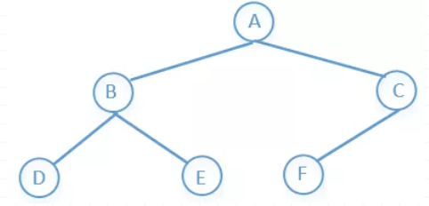
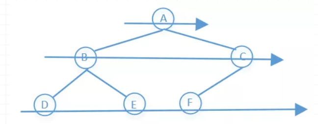
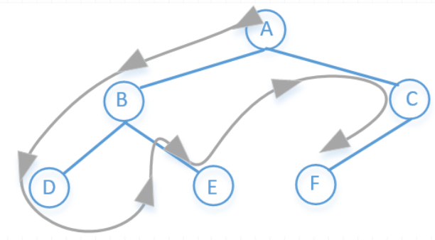

# BFS和DFS


<!--more-->

> **BFS**（Breadth First Search）：广度优先搜索
>
> **DFS**（Depth First Search）：深度优先搜索

如图为一个树结构：



#### BFS

宽度优先搜索(又称广度优先搜索)，实际上就是**层次遍历**，先访问上一层，在访问下一层，一层一层的往下访问，所以搜索结果是：



**A→B→C→D→E→F**



实现过程：**队列**，先进先出



1、首先A入队列 --`[A]`

2、A出队列时，A的邻接结点B，C相应进入队列 --`[B, C]`

3、B出队列时，B的邻接结点D，E进入队列 --`[C, D, E]`

4、C出队列时，C的邻接结点F进入队列 --`[D, E, F]`

5、D出队列 --`[E, F]`

6、E出队列 --`[F]`

7、F出队列 --`[]`



代码如下：

```python
def bfs(self):
    # 先添加根节点
    queue = [self.root]
    while queue:
        # push先进来的节点
        cur_node = queue.pop(0)
        print(cur_node.element)
        # 加入左子结点
        if cur_node.lchild:
            queue.append(cur_node.lchild)
        # 加入右子节点
        if cur_node.rchild:
            queue.append(cur_node.rchild)
```

#### DFS

深度优先搜索，说白了就是先一个劲向下，沿着**“树根”**遍历搜索

具体就是先访根节点，然后左结点，一直往下，直到最左结点没有子节点的时候然后往上退一步到父节点，然后父节点的右子节点在重复上面步骤……，所以搜索结果是：



**A→B→D→E→C→F**



实现过程：**栈**，先进后出



1、首先A入栈 --`[A]`

2、A出栈时，A的邻接结点C，B（注意顺序）相应进入栈 --`[C, B]`

3、B出栈时，B的邻接结点E、D进入栈 --`[C, E, D]`

4、D出栈 --`[C, E]`

5、E出栈 --`[C]`

6、C出栈时，C的邻接结点F进入栈 --`[F]`

7、F出栈 --`[]`



代码如下：

```python 
def dfs(self, root):
    # 添加根节点
    stack = [root]
    while stack:
        # 先进栈的出栈
        node = stack.pop()
        # 左节点入栈
        if node.left:
            stack.append(node.left)
        # 右节点入栈
        if node.right:
            stack.append(node.right)
```


