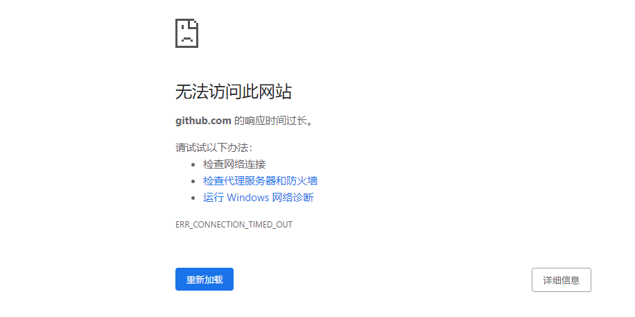
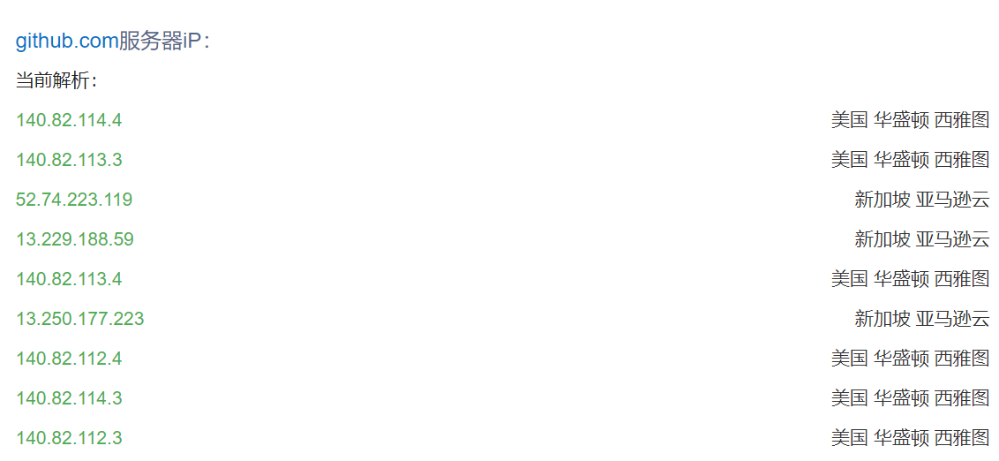
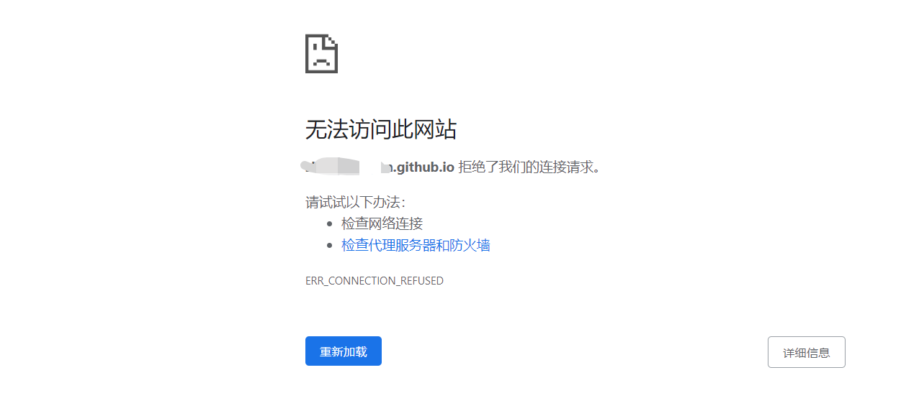
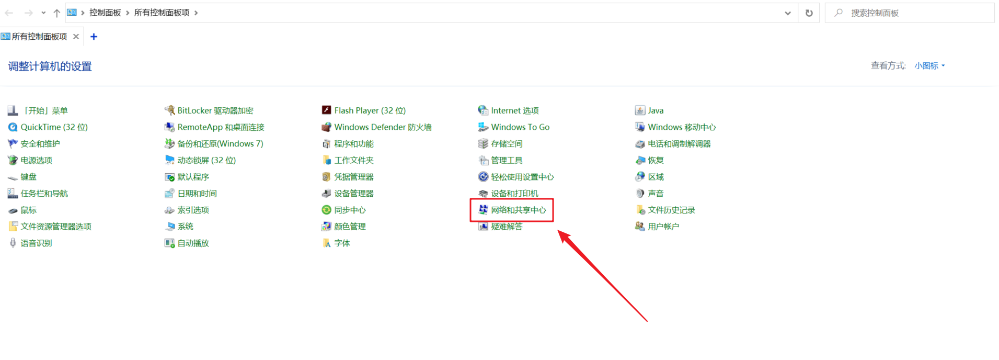
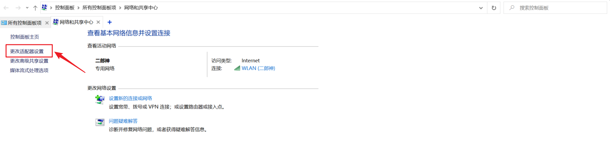
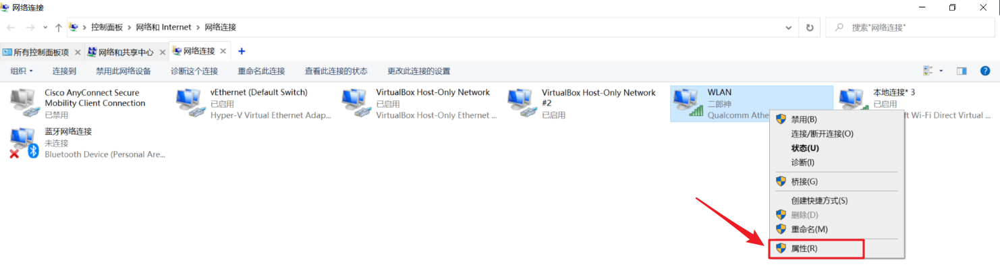
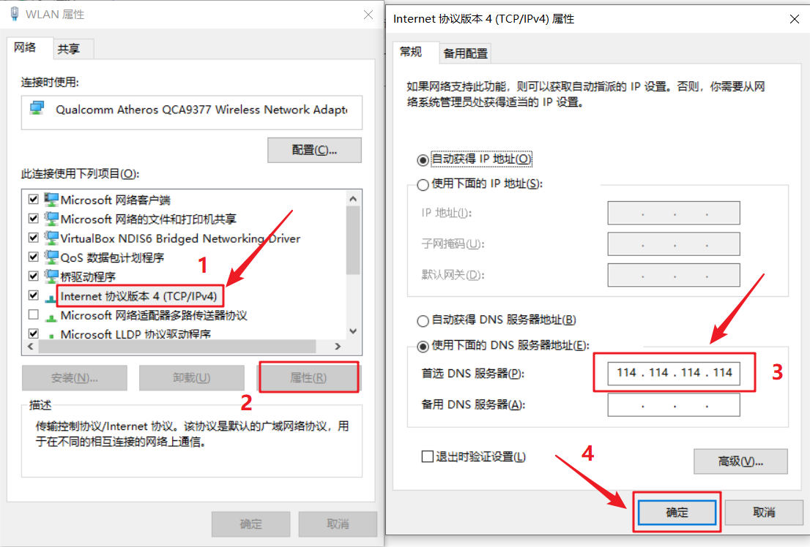

# github打不开，github.io访问被拒……


<!--more-->

#### github打不开

最近遇到github打不开的问题，如图，一直以为被q了……



百度之后发现，主要是GitHub那些网址IP更换了，

电脑里的`C:\Windows\System32\drivers\etc`中的`host`文件中DNS解析都已经过期了，

解决方法就是在网站<https://ipchaxun.com/> ，输入`github.com`查询新的IP……



对应的把下面的内容复制到`C:\Windows\System32\drivers\etc`路径的`host`文件中

```
# GitHub Start 
140.82.114.4 github.com
140.82.114.4 gist.github.com
185.199.108.153 assets-cdn.github.com
151.101.64.133 raw.githubusercontent.com
151.101.108.133 gist.githubusercontent.com
151.101.108.133 cloud.githubusercontent.com
151.101.108.133 camo.githubusercontent.com
151.101.108.133 avatars0.githubusercontent.com
151.101.108.133 avatars1.githubusercontent.com
151.101.108.133 avatars2.githubusercontent.com
151.101.108.133 avatars3.githubusercontent.com
151.101.108.133 avatars4.githubusercontent.com
151.101.108.133 avatars5.githubusercontent.com
151.101.108.133 avatars6.githubusercontent.com
151.101.108.133 avatars7.githubusercontent.com
151.101.108.133 avatars8.githubusercontent.com 
# GitHub End
```

在重新访问`https://github.com`，问题解决。

#### github.io访问被拒

自己是用[Gitpage](https://pages.github.com/)搭建自己的个人博客，但是在没有tz的时候总是无法访问，直接重击我搭建博客的耐心……



还是百度一下（百度不行，就Google），原因好像是电信运营商 **DNS 污染**（域名指往不正确的IP地址），

可以通过修改 `hosts文件` / `修改DNS服务器` / `代理` 的方式访问。

操作简单的，可将 DNS 修改为 `114.114.114.114`，我改完后就可以访问了。

具体操作如下（win10）：

1、打开**控制面板**，点击**网络和共享中心**



2、点击**更改适配器设置**



3、选择自己连接的网络，右键 --> **属性**



4、选择**Internet协议版本4(TCP/IPv4)**，点击**属性**，点选使用下面的**DNS服务器地址（E）**，输入`114.114.114.114`，点击**确定**，收工。



再访问博客，就能访问了。
