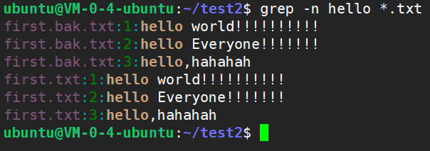
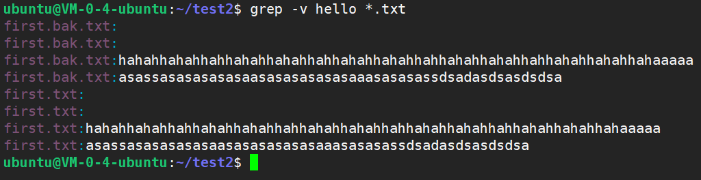

# Linux-grep命令


<!--more-->

> Linux `grep` 命令用于查找文件里符合条件的字符串。

`grep` 指令用于查找内容包含指定的范本样式的文件，如果发现某文件的内容符合所指定的范本样式，预设 `grep` 指令会把含有范本样式的那一列显示出来。若不指定任何文件名称，或是所给予的文件名为 `-`，则 `grep` 指令会从标准输入设备读取数据。

#### 语法

```
grep [-abcEFGhHilLnqrsvVwxy][-A<显示列数>][-B<显示列数>][-C<显示列数>][-d<进行动作>][-e<范本样式>][-f<范本文件>][--help][范本样式][文件或目录...]
```

#### 参数

- `-a 或 --text` : 不要忽略二进制的数据。
- `-A <显示行数> 或 --after-context=< 显示行数 >` : 除了显示符合范本样式的那一列之外，并显示该行之后的内容。
- `-b 或 --byte-offset` : 在显示符合样式的那一行之前，标示出该行第一个字符的编号。
- `-B <显示行数> 或 --before-context=< 显示行数 >` : 除了显示符合样式的那一行之外，并显示该行之前的内容。
- `-c 或 --count` : 计算符合样式的列数。
- `-C <显示行数> 或 --context=< 显示行数 > 或 -< 显示行数 >` : 除了显示符合样式的那一行之外，并显示该行之前后的内容。
- `-d <动作> 或 --directories=< 动作 >` : 当指定要查找的是目录而非文件时，必须使用这项参数，否则 grep 指令将回报信息并停止动作。
- `-e <范本样式> 或 --regexp=< 范本样式 >` : 指定字符串做为查找文件内容的样式。
- `-E 或 --extended-regexp` : 将样式为延伸的正则表达式来使用。
- `-f <规则文件> 或 --file=< 规则文件 >` : 指定规则文件，其内容含有一个或多个规则样式，让 `grep` 查找符合规则条件的文件内容，格式为每行一个规则样式。
- `-F 或 --fixed-regexp` : 将样式视为固定字符串的列表。
- `-G 或 --basic-regexp` : 将样式视为普通的表示法来使用。
- `-h 或 --no-filename` : 在显示符合样式的那一行之前，不标示该行所属的文件名称。
- `-H 或 --with-filename` : 在显示符合样式的那一行之前，表示该行所属的文件名称。
- `-i 或 --ignore-case` : 忽略字符大小写的差别。
- `-l 或 --file-with-matches` : 列出文件内容符合指定的样式的文件名称。
- `-L 或 --files-without-match` : 列出文件内容不符合指定的样式的文件名称。
- `-n 或 --line-number` : 在显示符合样式的那一行之前，标示出该行的列数编号。
- `-o 或 --only-matching` : 只显示匹配 `PATTERN` 部分。
- `-q 或 --quiet 或 --silent` : 不显示任何信息。
- `-r 或 --recursive` : 此参数的效果和指定`-d recurse`参数相同。
- `-s 或 --no-messages` : 不显示错误信息。
- `-v 或 --revert-match` : 显示不包含匹配文本的所有行（反向查找）。
- `-V 或 --version` : 显示版本信息。
- `-w 或 --word-regexp` : 只显示全字符合的列。
- `-x --line-regexp` : 只显示全列符合的列。
- `-y` : 此参数的效果和指定`-i`参数相同。

#### 实例

1、在当前目录中，查找后缀有 `.txt` 字样的文件中包含 `hello` 字符串的文件，并打印出该字符串的行：

```
grep -n hello *.txt # -n显示行号
```

结果如下所示：



2、以**递归**的方式查找符合条件的文件。例如，查找指定目录 `/etc/acpi` 及其子目录（如果存在子目录的话）下所有文件中包含字符串`update`的文件，并打印出该字符串所在行的内容，使用的命令为：

```
grep -r update /etc/acpi 
```

3、反向查找。前面各个例子是查找并打印出符合条件的行，通过`-v`参数可以打印出不符合条件行的内容。

查找文件名中包含`.txt` 的文件中不包含 `hello` 的行，此时，使用的命令为：

```
grep -v hello *.txt
```

结果如下所示：



4、大文件查找。系统报警显示了时间，但是日志文件太大无法直接 `cat` 查看。(查询含有特定文本的文件，并拿到这些文本所在的行)

解决：

```shell
grep -n '2019-10-24 00:01:11' *.log
```

#### grep对比find 

从文件内容查找匹配指定字符串的行：

```
$ grep "被查找的字符串" 文件名
```

在当前目录里第一级文件夹中寻找包含指定字符串的 .in 文件

```
grep "thermcontact" /.in
```

从文件内容查找与正则表达式匹配的行：

```
$ grep –e "正则表达式" 文件名
```

查找时不区分大小写：

```
$ grep –i "被查找的字符串" 文件名
```

查找匹配的行数：

```
$ grep -c "被查找的字符串" 文件名
```

从文件内容查找不匹配指定字符串的行：

```
$ grep –v "被查找的字符串" 文件名
```

从根目录开始查找所有扩展名为 `.log` 的文本文件，并找出包含 `"ERROR"` 的行：

```
$ find / -type f -name "*.log" | xargs grep "ERROR"
```

从当前目录开始查找所有扩展名为 `.in` 的文本文件，并找出包含 `"thermcontact"` 的行：

```
find . -name "*.in" | xargs grep "thermcontact"
```

**注：`xargs`是把左侧的标准输出转化为右侧的格式化参数**，如果没有`xargs`的作用，那么那么上述两行语句的作用就是在一堆文件名中查找匹配的**文件名**，有了`xargs`，就是在一堆文件中查找匹配的**内容行**。
