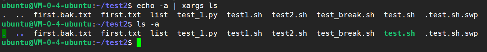

# Linux-xargs命令


<!--more-->

> 对 `find`，`xargs`，`grep` 和`|`的一些总结。[参考文献](http://fatmouse.xyz/2016/05/10/2016-05-10-find-grep-xargs-and-pipe/)

- `xargs` 是给命令传递参数的一个过滤器，也是组合多个命令的一个工具。
- `xargs` 可以将管道或标准输入`（stdin）`数据转换成命令行参数，也能够从文件的输出中读取数据。
- `xargs` 也可以将单行或多行文本输入转换为其他格式，例如多行变单行，单行变多行。
- `xargs` 能够捕获一个命令的输出，然后传递给另外一个命令。
- `xargs` 一般是和管道一起使用。

##### 问题

一般在目录中搜索含有固定字符串文件的命令：

```
find . -name '*.py' |xargs grep test
```

刚开始的时候，不熟悉 `xargs` 命令，大部分人可能直接使用的命令是：

```
find . -name '*.py' |grep test
```

结果并不是自己所期望的。此命令只是找出文件名 `*.py 有 `test` 的情况。

究竟 `xargs` 做了什么，使得结果不相同？

##### 参数与标准输入

这两个词我们在 `Linux` 命令中是很常见的。但是参数和标准输入其实是有区别的。

我们日常使用的很多命令，例如 `ls -lah .` 中。`l`， `a`， `h` ，`.` 都是命令 `ls` 的参数。至于标准输入，**通常来讲标准输入的数据来源就是我们的终端输入**。在 `Linux` 命令中，有些命令可以接收标准输入，有些是不能的。像上面的 `ls`，就是只能接收参数，不能接收标准输入。像 `cat` 命令或 `echo` 命令，这些是可以的。

怎么分辨一个命令可不可以接收标准输入？

很简单，当你敲完命令回车后，终端会等待接收你的输入，例如当你在终端输入 `cat` 后，终端会等待你输入字符，当你输入一些字符后，然后按 `Ctrl-C` 发送终止符号。这时 `cat` 命令接收标准输入完毕，执行命令，也就是将刚才键入的内容输出的标准输出上（屏幕）。

##### 管道

管道的作用是将前面命令的**标准输出**作为后面命令的**标准输入**。这里要注意，后面的命令接收的是标准输入，所以如果命令不支持接收标准输入，那么就不能直接使用管道，例如常用的 `ls` 命令，只能使用参数，而不能使用标准输入，所以 `[command] | ls` 是不能使用的。而命令如 `echo` 或 `cat` 就可以。有啥方法来实现这些不能使用标准输入的命令与管道结合呢？这时候 `xargs` 便出场了。

##### xargs 命令

`xargs` 命令通俗来讲就是**将标准输入转成各种格式化的参数**，所以命令 `[command 1] | xargs [command 2]` 就是将 `command 1` 的标准输出结果，通过管道 `|` 变成 `xargs` 的标准输入，然后 `xargs` 再将此标准输入变成参数，传给 `[command 2]`。这样一来，通过 `xargs` 命令，我们便可以在管道后面使用那些不接收标准输入的命令了。例如 `[command 1]|xargs ls`。

比如我们通过`xargs`实现`ls-a`

```
echo -a | xargs ls
```



##### find 与 grep

了解以上的知识点，就可以解答最开始的问题

```
find . -name '*.py' |grep test
```

和

```
find . -name '*.py' |xargs grep test
```

结果到底为什么不一样。

我们首先来查看 grep 手册。通过 `man grep` 命令。

```shell
DESCRIPTION grep searches the named input FILEs (or standard input if no files are named, or if a single hyphen-minus (-) is given as file name) for lines containing a match to the given PATTERN.  By default, grep prints the matching lines.
```

这里可以看到 grep 是支持标准输入的。

假设目录存在如下文件：

```
lsAltitest.py  python.py  runora.py  test.py  TransferFile.py
```

那么对于第一个命令 `find . -name '*.py' |grep test`，是将前面命令的标准输出作为标准输入传给了 `grep test`，那么 `grep` 是从这些标准输入寻找 `test` 字符，也就是**文件名组成的字符流**。

```
find . -name '*.py' |grep test
```

可以看到最终选择出的是这些文件名：

```
./Altitest.py
./test.py
```

而对于第二个命令 `find . -name '*.py' |xargs grep test`，通过 `xargs`，`find` 得到的文件名成为了**参数**传给后面的 `grep`，那么这时候这些文件名就是实实在在的**文件标识**，`grep` 接收后会按正常的使用方式在各文件中搜寻字符串（**内容行**）。

```
find . -name '*.py' |xargs grep test
```

结果：

```
./runora.py:testConn = cx_Oracle.connect('user/passwd@tns')
./runora.py:testCursor = testConn.cursor()
./runora.py:testCursor.execute("select * from table")
./runora.py:rows = testCursor.fetchall()
./runora.py:testCursor.close()
./runora.py:testConn.close()
```


