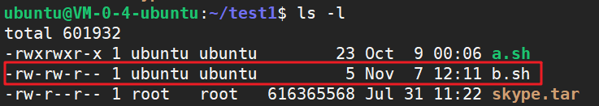

# linux-脚本执行命令


<!--more-->

> shell脚本的执行命令主要有`source`、`bash`、`sh`、`.`、`./`，具体的区别如下.

#### 1、`source`

```shell
source a.sh
```

在**当前** `shell` 内去读取执行 `a.sh`，而 `a.sh` 不需要有 " **执行权限** "，**因为在当前shell执行，所以会影响当前shell的环境**。

比如当前在`~/test1`目录：


```shell
# 创建sh文件，切换到根目录
echo 'cd /' > b.sh
```

此时`b.sh`没有执行权限



可直接执行`source b.sh`：





`source`命令可以简写为 `.`：

```bash
source a.sh = . a.sh
```



#### 2、`sh`/`bash`

```shell
sh a.sh
bash a.sh
```

都是**打开一个 `subshell`** 去读取执行 `a.sh`，而 `a.sh` 不需要有 " **执行权限** "。

通常在 `subshell` 里运行的脚本里设置变量，不会影响到`父shell` 的。

> 当在执行一个 Shell Script 时，父 Shell 会根据 Script 程序的第一行 `#!` 之后指定的 Shell 程序开启一个子 Shell 环境，然后在子 Shell 中执行此 Shell Script。 一旦子 Shell 中的 Script 执行完毕，此子 Shell 随即结束，回到父 Shell 中，不会影响父 Shell 原本的环境。**子 Shell 环境拥有与父 Shell 相同的环境变量、标准输入、输出、错误等。**



#### 3、`./`

```bash
./a.sh
#bash: ./a.sh: 权限不够
chmod +x a.sh
./ a.sh
```

**打开一个 `subshell`** 去读取执行 `a.sh`，但 `a.sh` 需要有 " **执行权限** "，可以用 `chmod +x` 添加执行权限。


