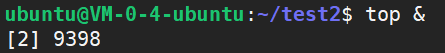
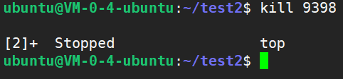
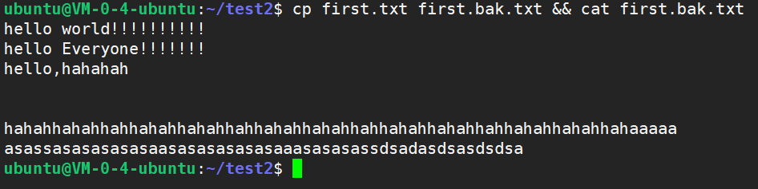
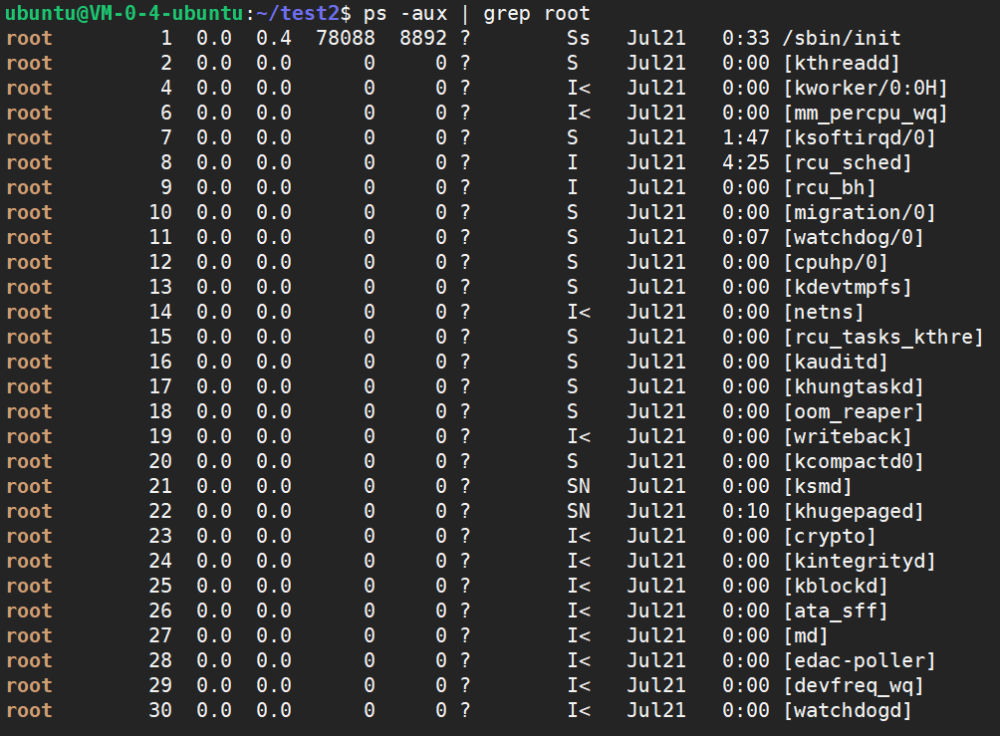
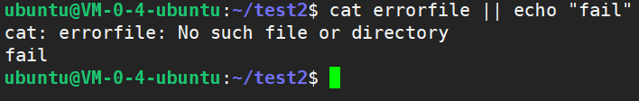

# Linux中的&&和&，|和||


<!--more-->

#### &

> `&`表示任务在**后台执行**
>
> 默认情况下，进程是前台进程，这时就把 Shell 给占据了，我们无法进行其他操作，对于那些没有交互的进程，很多时候，我们希望将其在后台启动，可以在启动参数的时候加一个 `&` 实现这个目的

比如我们要把一个文件复制到另一个目录中：

```shell
cp -R original/dir/ backup/dir/
```

如果复制的文件太多太大，**直接会导致当前终端卡住**。

可以在命令的末尾加上一个 `&` 号，将这个任务放到后台去执行：

```shell
cp -R original/dir/ backup/dir/ &
```

任务被放到后台执行之后，就可以继续在同一个终端上操作了，甚至关闭终端也不影响这个任务的正常执行。**需要注意的是**，如果要求这个任务输出内容到标准输出中（例如 `echo` 或 `ls`），即使使用了 `&`，也会等待这些输出任务在前台运行完毕。

当使用 `&` 将一个进程放置到后台运行的时候，`Bash` 会提示这个进程的进程 `ID`

比如我们后台执行`top`命令：`top &`



返回了`top`进程的`id-->9398`，如果杀掉该进程，可以发现`top stopped`。



#### &&

> 命令之间使用 && 连接，实现**逻辑与**的功能。 
>
> 在执行某个**命令**时，有时需要依赖前面的命令是否执行成功。`&&`表示前一条命令执行成功时，才执行后一条命令 。

格式：`command1 && command2`

例如，当把文件 `first.txt` 复制一份为 `first.bak.txt`  成功，然后显示副本  `first.bak.txt` 

```shell
cp first.txt first.bak.txt && cat first.bak.txt
```



#### |

> `|` 表示管道，上一条命令的输出，作为下一条命令参数。
>
> Linux 所提供的管道符 `|` 将两个命令隔开，管道符左边命令的输出就会作为管道符右边命令的输入。连续使用管道意味着第一个命令的输出会作为 第二个命令的输入，第二个命令的输出又会作为第三个命令的输入，依此类推。

如：

```shell
echo 'yes' | wc -l # 显示输入的行数
```

再比如获取特定的进程信息：

```shell
ps -aux | grep root # 显示含root的进程
```



#### ||

> 命令之间使用 `||` 连接，实现逻辑或的功能，表示上一条命令执行失败后，才执行下一条命令。
>
> 只有在 `||` 左边的命令返回假（命令返回值 `$? == 1`），`||` 右边的命令才会被执行。 
> 只要有一个命令返回真（命令返回值 `$? == 0`），后面的命令就不会被执行。 –直到返回真的地方停止执行。

如 

```shell
cat errorfile || echo "fail"  # cat一个错误的文件，然后就会打印fail
```


