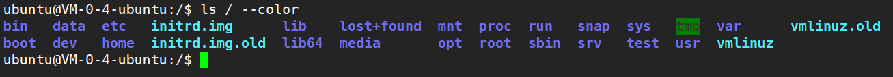
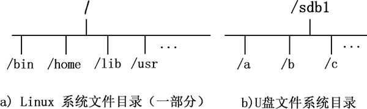
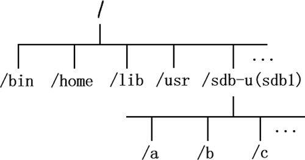

# Linux挂载

<!--more-->



名词解释：

挂载，指的就是将设备文件中的顶级目录连接到 Linux 根目录下的某一目录（最好是空目录），访问此目录就等同于访问设备文件。



> Linux 系统中“一切皆文件”，所有文件都放置在以根目录为树根的树形目录结构中，输入 `tree /`即可查看

- 在 Linux 看来，任何硬件设备也都是文件，它们各有自己的一套文件系统（文件目录结构）
- 当在 Linux 系统中使用这些硬件设备时，只有将Linux本身的文件目录与硬件设备的文件目录合二为一，硬件设备才能为linux所用。**合二为一的过程称为“挂载”。**



Windows下，`mount`挂载，就是给磁盘分区提供一个盘符（`C,D,E,...`）。比如插入U盘后，系统自动分配`I`或`E`或者其他的盘符，盘符其实就是挂载，退优盘的时候进行安全弹出，其实就是卸载：`unmount`。





Linux下，不像Windows可以有`C,D,E`多个目录，Linux只有一个根目录`/`。在装系统时，分配给linux的所有区都在`/`下的某个位置，比如`/home`等等。



具体挂载的过程看下面的例子



以插入硬盘为例，假如插入了新硬盘，分了新磁盘区`sdb1`。它现在还不属于`/`，如图所示：

- 目前 U 盘和 Linux 系统文件分属两个文件系统，还无法使用命令行找到 U 盘文件，需要将两个文件系统进行挂载。
- 虽然可以在一些Linux图形桌面系统里找到位置，浏览管理里面的文件，但在命令行却不知道怎么访问，比如无法使用`cd`或者`ls`。更无法在编程时指定一个目录对其操作。

接下来，我们在根目录下新建一个目录 `/sdb-u`，通过挂载命令将 U 盘文件系统挂载到此目录，如图所示：

- 挂载命令：`mount /sdb1 /sdb-u`
- 把U盘的区`sdb1`挂载到Linux根目录的`/sdb-u`文件夹下，之后访问这个`/sdb-u`文件夹就相当于访问这个U盘了。对`/sdb-u`的任何操作，都相当于对U盘里文件的操作。



**所以直白讲，Linux下，mount挂载的作用，就是将一个设备（通常是存储设备）挂接到一个已存在的目录上，访问这个目录就是访问该存储设备。**

1. linux操作系统将所有的设备都看作文件，它将整个计算机的资源都整合成一个大的文件目录。
2. 要访问存储设备中的文件，必须将文件所在的分区挂载到一个已存在的目录上，然后通过访问这个目录来访问存储设备。
3. 挂载就是把设备放在一个目录下，让系统知道怎么管理这个设备里的文件，了解这个存储设备的可读写特性之类的过程。



**插入U盘后不是自动分盘到`/sdb1` 吗，直接对它操作不就行了？这不是它的目录吗？**



`/sdb1`不是目录。可以发现`ls /sdb1`无法执行。`/sdb1`是一个类似指针的东西，指向这个分区的原始数据块。mount前，系统并不知道这个数据块哪部分数据代表文件，也不知道如何对它们操作。



插入CD，系统其实自动执行了 `mount /dev/cdrom /media/cdrom`。所以可以直接在系统的`/media/cdrom`中对CD中的内容进行管理。


