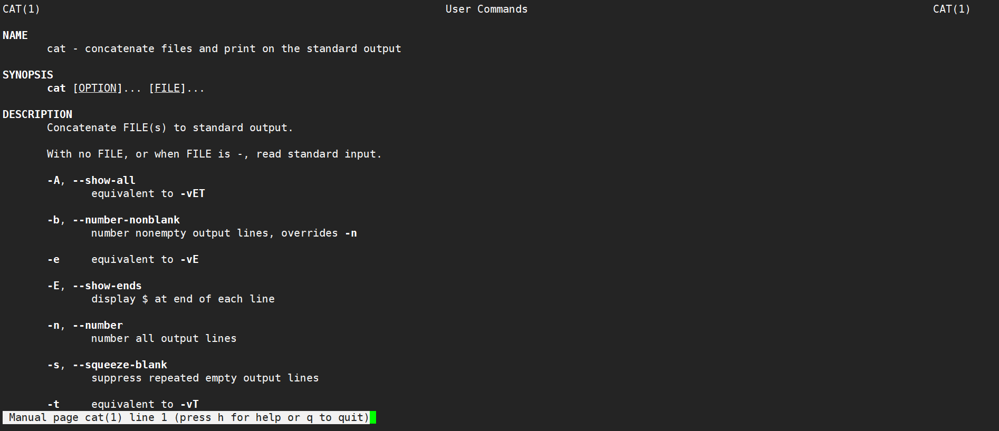

# Linux文件内容查看


<!--more-->

> 学习linux，必然少不了经常对文件内容的查看，以下是一些常用的查看命令。

Linux系统中使用以下命令来查看文件的内容：

- `cat`  由第一行开始显示文件内容
- `tac`  从最后一行开始显示，可以看出 `tac` 是 `cat` 的倒着写！
- `nl`   显示的时候，顺道输出行号！
- `more` 一页一页的显示文件内容
- `less` 与 `more` 类似，但是比 `more` 更好的是，他可以往前翻页！
- `head` 只看头几行
- `tail` 只看尾巴几行

你可以使用 `man [命令]`来查看各个命令的使用文档，如 ：`man cat`。



### cat（第一行显示）

由第一行开始显示文件内容

```
cat [-AbEnTv]
```

选项与参数：

- `-A` ：相当於 `-vET` 的整合选项，可列出一些特殊字符而不是空白而已；
- `-b` ：列出行号，仅针对非空白行做行号显示，空白行不标行号！
- `-E` ：将结尾的断行字节 `$` 显示出来；
- `-n` ：列印出行号，连同空白行也会有行号，与 `-b` 的选项不同，效果类似`nl`命令；
- `-T` ：将 `[tab]` 按键以 `^I` 显示出来；
- `-v` ：列出一些看不出来的特殊字符

检看 `/etc/issue` 这个文件的内容：

```
cat /etc/issue
Ubuntu 18.04.4 LTS \n \l
                          # 多出一个空行
```

### tac（最后一行显示）

`tac`与`cat`命令刚好相反，文件内容从最后一行开始显示（倒序显示），如：

```
tac /etc/issue
						# 空行在前面
Ubuntu 18.04.4 LTS \n \l
```

### nl（显示行号）

显示行号

```
nl [-bnw] 文件
```

选项与参数：

- `-b` ：指定行号指定的方式，主要有两种：
  - `-b a` ：表示不论是否为空行，也同样列出行号(类似 `cat -n`)；
  - `-b t` ：如果有空行，空的那一行不要列出行号(默认值)；
- `-n` ：列出行号表示的方法，主要有三种：
  - `-n ln` ：行号在荧幕的最左方显示；
  - 
  - `-n rn` ：行号在自己栏位的最右方显示，且不加 0 ；
  - 
  - `-n rz` ：行号在自己栏位的最右方显示，且加 0 ；
  - 
- `-w` ：行号栏位的占用的位数。

### more（翻页）

一页一页翻动

```
more /etc/man_db.config 
#
# Generated automatically from man.conf.in by the
# configure script.
#
# man.conf from man-1.6d
....(中间省略)....
--More--(28%)  <== 光标在这里等待你的命令
```

在 `more` 这个程序的运行过程中，有以下命令可执行：

- `空白键 (space)`：代表向下翻一页；
- `Enter`：代表向下翻『一行』；
- `/字串` ：代表在这个显示的内容当中，向下搜寻`字串`这个关键字；
- `:f`：立刻显示出档名以及目前显示的行数；
- `q`：代表立刻离开 more ，不再显示该文件内容。
- `b 或 [ctrl]-b`：代表往回翻页，只对文件有用。

### less（翻页）

一页一页翻动，以下实例输出`/etc/man.config`文件的内容：

```
less /etc/man.config
#
# Generated automatically from man.conf.in by the
# configure script.
#
# man.conf from man-1.6d
....(中间省略)....
:   <== 这里可以等待你输入命令！
```

在`less`这个程序的运行过程中，有以下命令可执行：

- `空白键`：向下翻动一页；
- `[pagedown]`：向下翻动一页；
- `[pageup]`：向上翻动一页；
- `/字串`：向下搜寻`字串`的功能；
- `?字串`：向上搜寻`字串`的功能；
- `n`：重复前一个搜寻 (与 `/` 或 `?` 有关)
- `N`：反向的重复前一个搜寻 (与 `/` 或 `?` 有关)
- `q`：离开 `less` 这个程序；

### head（显示头几行）

取出文件前面几行

```
head [-n number] 文件 
```

选项与参数：

- -n ：后面接数字，代表显示几行的意思

```
head /etc/man.config
```

默认的情况中，显示前面 10 行！若要显示前 20 行，就得要这样：

```
head -n 20 /etc/man.config
```

### tail（显示尾几行）

取出文件后面几行

```
tail [-n number] 文件 
```

选项与参数：

- -n ：后面接数字，代表显示几行的意思

```
tail /etc/man.config
# 默认的情况中，显示最后的十行！若要显示最后的 20 行，就得要这样：
tail -n 20 /etc/man.config
```
