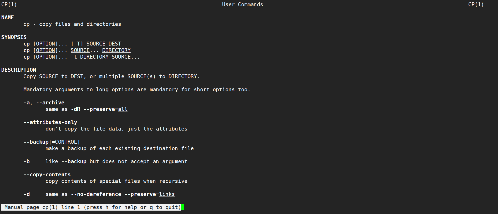
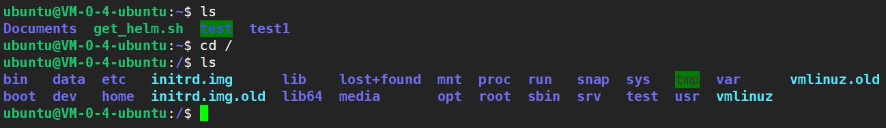

# Linux文件和目录管理


<!--more-->

对于文件和目录的管理，**可视化界面操作只需要鼠标点点点**即可，例如`windows`系统的文件资源管理器，在linux系统中，虽然也有一些图形界面，不过熟悉命令操作后，速度也不慢。

- `ls`: 列出目录及文件名
- `cd`：切换目录
- `pwd`：显示目前的路径
- `mkdir`：创建一个新的目录
- `rmdir`：删除一个空的目录
- `cp`: 复制文件或目录
- `rm`: 移除文件或目录
- `mv`: 移动文件与目录，或修改文件与目录的名称

> 可以使用 `man [命令]` 来查看各个命令的使用文档，如 ：`man cp`



### ls (列出目录)

> 在Linux系统当中， `ls` 命令可能是最常被运行的。

选项与参数（可以搭配使用）：

- `-a` ：**全部文件**，连同隐藏文件( 开头为`.`的文件) 一起列出来(常用)
- `-d` ：仅列出**目录本身**，而不列出目录内的文件数据(常用)
- `-l` ：长数据串列出，包含文件的**属性与权限**等等数据(常用)

将`home`目录下的所有文件列出来(**含属性与隐藏文件**)：`ls -al ~`



`ls --color`可以显示不问类型文件的颜色，永久显示的话，

- 1、在`home`目录下

```
cd ~
```

- 2、打开`.bashrc`文件，没有的话，创建`touch .bashrc`，再打开

```
vim .bashrc
```

- 3、输入`i`，加入`alias ls='ls --color'`，按`esc`，输入`:wq`保存退出

- 4、然后重新加载该文件即可

```
source ./.bashrc
```







重启后颜色显示失效，说明没有自动加载`.bashrc`文件，先打开`.bash_profile`文件：`vim ~/.bash_profile` 

添加如下代码即可

```shell
if test -f .bashrc ; then  # 测试.bashrc存在且为普通文件则为真
source .bashrc
fi
```



### cd (切换目录)

> cd是Change Directory的缩写，这是用来变换工作目录的命令。

```
使用 mkdir 命令创建 runoob 目录
	mkdir runoob
使用绝对路径切换到 runoob 目录
	cd /root/runoob/
使用相对路径切换到 runoob 目录
	cd ./runoob/
进入上级目录
    cd ..
进入当前用户主目录
    cd ~
进入根目录
	cd /
进入上两级目录
    cd ../..
进入当前目录
    cd .
进入目录/etc/docker
    cd /etc/docker
```

### pwd (显示目前所在的目录)

> pwd 是 **Print Working Directory** 的缩写，也就是显示目前所在目录的命令。

```
pwd [-P]
```

选项与参数：

- **`-P`** ：显示出确实的路径，而非使用连结 (link) 路径。

实例：单纯显示出目前的工作目录：

```
pwd
/root   <== 显示出目录啦～
```

实例显示出实际的工作目录，而非连结档本身的目录名而已。

```
cd /var/mail   <==注意，/var/mail是一个连结档
pwd
/var/mail         <==列出目前的工作目录
pwd -P
/var/spool/mail   <==怎么回事？有没有加 -P 差很多～
ls -ld /var/mail
lrwxrwxrwx 1 root root 10 Sep  4 17:54 /var/mail -> spool/mail
# 因为 /var/mail 是连结档，连结到 /var/spool/mail 
# 所以，加上 pwd -P 的选项后，会不以连结档的数据显示，而是显示正确的完整路径
```

### mkdir (创建新目录)

> 想要创建新的目录的话，使用mkdir (make directory)即可。

```
mkdir [-mp] 目录名称
```

选项与参数：

- `-m` ：**配置文件的权限**
- **`-p` ：帮助你直接将所需要的目录(包含上一级目录)递归创建起来！**

实例：请到`/tmp`底下尝试创建数个新目录看看：

```
cd /tmp
mkdir test    <==创建一名为 test 的新目录
mkdir test1/test2/test3/test4
mkdir: cannot create directory `test1/test2/test3/test4': 
No such file or directory       <== 没办法直接创建此目录啊！
mkdir -p test1/test2/test3/test4
```

加了这个 `-p` 的选项，可以自行帮你创建多层目录！

创建权限为 **`rwx--x--x`** 的目录

```
mkdir -m 711 test2
ls -l
drwxr-xr-x  3 root  root 4096 Jul 18 12:50 test
drwxr-xr-x  3 root  root 4096 Jul 18 12:53 test1
drwx--x--x  2 root  root 4096 Jul 18 12:54 test2
```

上面的权限部分，如果没有加上 `-m` 来强制配置属性，系统会使用默认属性。如果我们使用 `-m` ，如上例我们给予 `-m 711` 来给予新的目录 `drwx--x--x` 的权限。

### rmdir (删除空的目录)

语法：

```
 rmdir [-p] 目录名称
```

选项与参数：

- `-p` ：连同上一级『空的』目录也一起删除

删除 runoob 目录

```
rmdir runoob/
```

将 `mkdir` 实例中创建的目录(`/tmp` 底下)删除掉！

```
ls -l   <==看看有多少目录存在？
drwxr-xr-x  3 root  root 4096 Jul 18 12:50 test
drwxr-xr-x  3 root  root 4096 Jul 18 12:53 test1
drwx--x--x  2 root  root 4096 Jul 18 12:54 test2
rmdir test   <==可直接删除掉，没问题
rmdir test1  <==因为尚有内容，所以无法删除！
rmdir: `test1': Directory not empty
rmdir -p test1/test2/test3/test4
ls -l        <==您看看，底下的输出中test与test1不见了！
drwx--x--x  2 root  root 4096 Jul 18 12:54 test2
```

利用 `-p` 这个选项，立刻就可以将 `test1/test2/test3/test4` 一次删除。

不过要注意的是，这个 `rmdir` **仅能删除空的目录**，你可以使用 `rm` 命令来删除非空目录。

### cp (复制文件或目录)

> cp 即拷贝文件和目录。

语法:

```
cp [-adfilprsu] 来源档(source) 目标档(destination)
cp [options] source1 source2 source3 .... directory
```

选项与参数：

- `-a`：相当於 -pdr ，参数 pdr 分别为：保留权限，bai 复制软链接本身，递归复制；(常用)
- `-d`：若来源档为连结档的属性(link file)，则复制连结档属性而非文件本身；
- `-f`：为强制(force)的意思，若目标文件已经存在且无法开启，则移除后再尝试一次；
- `-i`：若目标档(destination)已经存在时，在覆盖时会先询问动作的进行(常用)
- `-l`：进行硬式连结(hard link)的连结档创建，而非复制文件本身；
- `-p`：连同文件的属性一起复制过去，而非使用默认属性(备份常用)；
- `-r`：递归持续复制，用於目录的复制行为；(常用)
- `-s`：复制成为符号连结档 (symbolic link)，亦即『捷径』文件；
- `-u`：若 destination 比 source 旧才升级 destination ！

用 `root` 身份，将 `root` 目录下的 `.bashrc` 复制到 `/tmp` 下，并命名为 `bashrc`

```
cp ~/.bashrc /tmp/bashrc
cp -i ~/.bashrc /tmp/bashrc
cp: overwrite `/tmp/bashrc'? n  <==n不覆盖，y为覆盖
```

### rm (移除文件或目录)

语法：

```
 rm [-fir] 文件或目录
```

选项与参数：

- `-f` ：就是 force 的意思，忽略不存在的文件，不会出现警告信息；
- `-i` ：互动模式，在删除前会询问使用者是否动作
- `-r` ：递归删除啊！最常用在目录的删除了！这是非常危险的选项！！！

将刚刚在 cp 的实例中创建的 bashrc 删除掉！

```
rm -i bashrc
rm: remove regular file `bashrc'? y
```

**如果加上 -i 的选项就会主动询问喔，避免你删除到错误的档名！**

### mv (移动文件与目录，或修改名称)

语法：

```
mv [-fiu] source destination
mv [options] source1 source2 source3 .... directory
```

选项与参数：

- `-f` ：force 强制的意思，如果目标文件已经存在，不会询问而直接覆盖；
- `-i` ：若目标文件 (destination) 已经存在时，就会询问是否覆盖！
- `-u` ：若目标文件已经存在，且 source 比较新，才会升级 (update)

复制一文件，创建一目录，将文件移动到目录中

```
cd /tmp
cp ~/.bashrc bashrc
mkdir mvtest
mv bashrc mvtest
```

修改目录名：将刚刚的目录名称更名为 mvtest2

```
mv mvtest mvtest2
```
