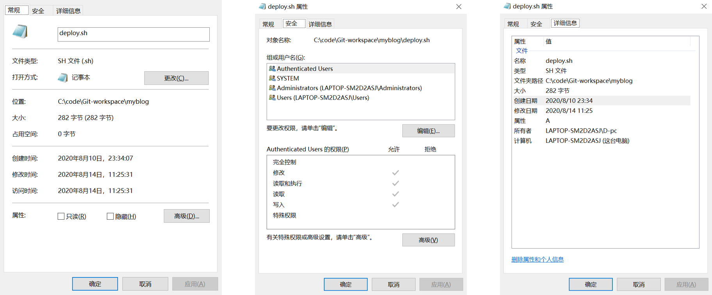
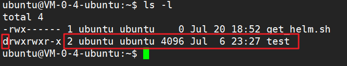
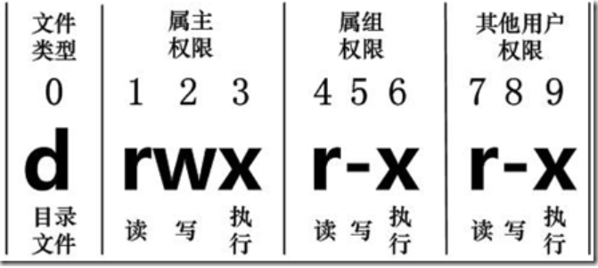

# Linux文件属性命令


<!--more-->

### windows系统

> 文件属性，在`windows`系统中，我们很少考虑文件的属性问题，默认即可。

当然需要修改的话，也很简单，右键`文件-->属性`，如下图所示（以文件为例）。

一般文件的属性有三种，包括**常规、安全、详细信息**，文件夹是**常规、安全、共享、自定义**。

在可修改的地方点击编辑即可，比如**组或用户名**、每个组或用户名对应的**控制权限**。



### linux系统

> 在`linux`系统中，文件的属性就显得稍微重要一点，可直接使用命令修改。

`ls –l`命令来显示一个文件的**属性以及文件所属的用户和组**

在Linux中第一个字符代表这个文件是目录、文件或链接文件等等。

- 当为**`d`**则是**目录**
- 当为**`-`**则是**文件**
- 若是**`l`**则表示为**链接文档**(link file)
- 若是**`b`**则表示为装置文件里面的可供储存的**接口设备**(可随机存取装置)
- 若是**`c`**则表示为装置文件里面的**串行端口设备**，例如键盘、鼠标(一次性读取装置)



接下来的字符中，以三个为一组，且均为`rwx` 的三个参数的组合。其中，

- `r`代表可读`(read)`
- `w`代表可写`(write)`
- `x`代表可执行`(execute)`

 要注意的是，这三个权限的位置不会改变，如果没有权限，就会出现减号`-`，每个文件的属性由左边第一部分的**10个字符**来确定，如下图:



从左至右用`0-9`这些数字来表示：

- 第`0`位确定文件类型；
- 第`1-3`位确定属主（该文件的所有者）拥有该文件的权限；
- 第`4-6`位确定属组（所有者的同组用户）拥有该文件的权限；
- 第`7-9`位确定其他用户拥有该文件的权限。

其中：

- 第`1, 4, 7`位表示读权限，如果用`r`字符表示，则有读权限，如果用`-`字符表示，则没有读权限；
- 第`2, 5, 8`位表示写权限，如果用`w`字符表示，则有写权限，如果用`-`字符表示没有写权限；
- 第`3, 6, 9`位表示可执行权限，如果用`x`字符表示，则有执行权限，如果用`-`字符表示，则没有执行权限。

### linux更改文件属性

#### 1、chgrp：更改文件属组

语法：

```
chgrp [-R] 属组名 文件名
```

参数选项

> **`-R`：递归更改文件属组，就是在更改某个目录文件的属组时，如果加上`-R`的参数，那么该目录下的所有文件的属组都会更改。**

#### 2、chown：更改文件属主

语法：

```
chown [–R] 属主名 文件名
chown [-R] 属主名：属组名 文件名
```

进入 `/root` 目录（~）将`install.log`的拥有者改为bin这个账号：

```
[root@www ~] cd ~
[root@www ~]# chown bin install.log
[root@www ~]# ls -l
-rw-r--r--  1 bin  users 68495 Jun 25 08:53 install.log
```

将install.log的拥有者与群组改回为root：

```
[root@www ~]# chown root:root install.log
[root@www ~]# ls -l
-rw-r--r--  1 root root 68495 Jun 25 08:53 install.log
```

#### 3、chmod：更改文件9个属性

Linux文件属性有两种设置方法，**一种是数字，一种是符号**。

Linux文件的基本权限就有九个，分别是`owner/group/others`三种身份各有自己的`read/write/execute`权限。

文件的权限字符为：`-rwxrwxrwx`， 这九个权限是三个三个一组的！其中，我们可以使用数字来代表各个权限，各权限的分数对照表如下：

| 字符 | 数值 |
| :--: | :--: |
|  r   |  4   |
|  w   |  2   |
|  x   |  1   |

每种身份(`owner/group/others`)各自的三个权限(`r/w/x`)分数是需要累加的，例如当权限为： `-rwxrwx---`分数则是：

- `owner = rwx = 4+2+1 = 7`
- `group = rwx = 4+2+1 = 7`
- `others= --- = 0+0+0 = 0`

所以等一下我们设定权限的变更时，该文件的权限数字就是`770`，变更权限的指令`chmod`的语法是这样的：

```
 chmod [-R] xyz 文件或目录
```



- `xyz` : 就是刚刚提到的数字类型的权限属性，为 `rwx` 属性数值的相加。
- `-R` : 进行递归的持续变更，即连同次目录下的所有文件都会变更



举例来说，如果要将`.bashrc`这个文件所有的权限都设定启用，那么命令如下：

```
[root@www ~]# ls -al .bashrc
-rw-r--r--  1 root root 395 Jul  4 11:45 .bashrc
[root@www ~]# chmod 777 .bashrc
[root@www ~]# ls -al .bashrc
-rwxrwxrwx  1 root root 395 Jul  4 11:45 .bashrc
```

那如果要将权限变成 `-rwxr-xr--` 呢？那么权限的分数就成为 `[4+2+1][4+0+1][4+0+0]=754`。

#### 4、chmod：符号类型改变文件权限

还有一个改变权限的方法，基本上就九个权限分别是：`user`、`group`、`others`。

可以使用 **`u, g, o`** 来代表三种身份的权限！

此外， `a` 则代表 `all`，即全部的身份。读写的权限可以写成 `r, w, x`，也就是可以使用下表的方式来看：

| chmod | u <br />g <br />o <br />a | +(加入) <br />-(除去) <br />=(设定) | r <br />w <br />x | 文件或目录 |
| :---: | ------------------------- | ----------------------------------- | ----------------- | :--------: |
|       |                           |                                     |                   |            |

将文件权限设置为 `-rwxr-xr--` ，可以使用 **`chmod u=rwx,g=rx,o=r 文件名`** 来设定:

```
touch test1    // 创建 test1 文件
ls -al test1    // 查看 test1 默认权限
-rw-r--r-- 1 root root 0 Nov 15 10:32 test1

chmod u=rwx,g=rx,o=r  test1    // 修改 test1 权限
ls -al test1
-rwxr-xr-- 1 root root 0 Nov 15 10:32 test1
```

去掉全部人的可执行权限：

```
chmod  a-x test1  // a为全部，-为减去，x为可执行
ls -al test1
-rw-r--r-- 1 root root 0 Nov 15 10:32 test1
```
