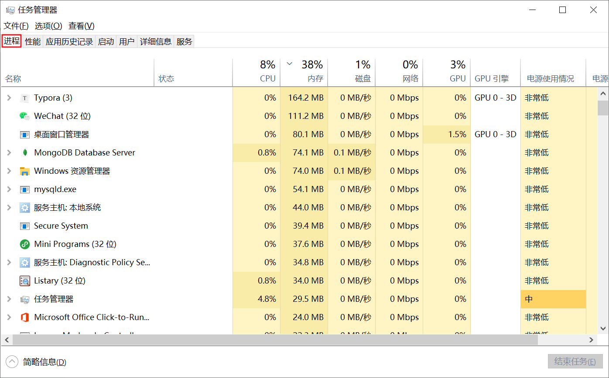
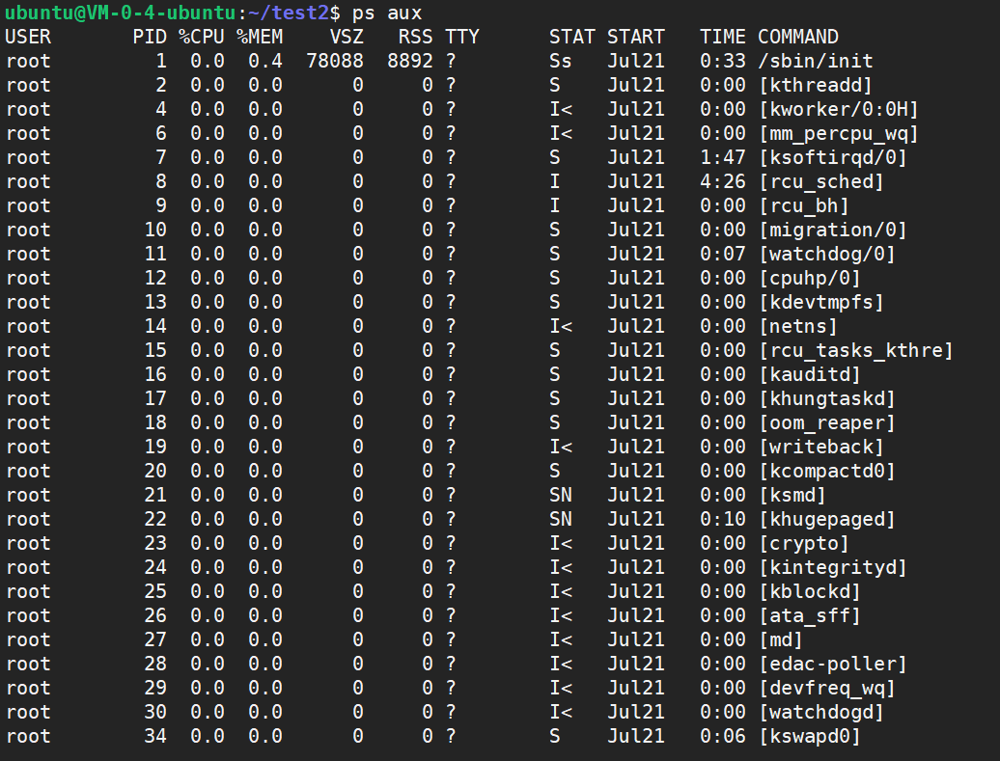
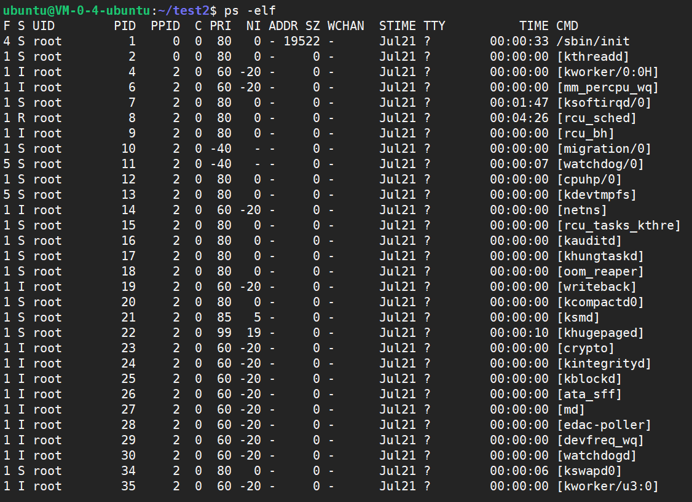
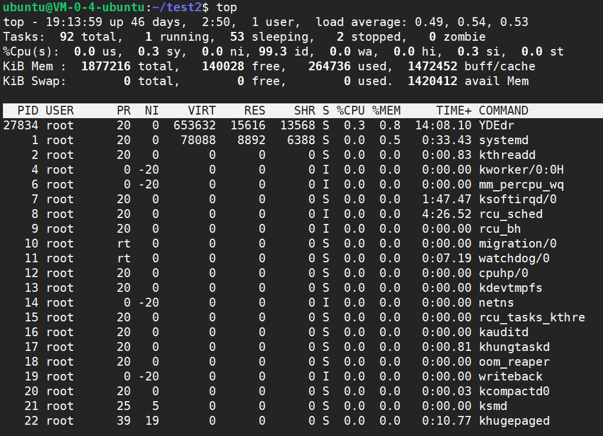
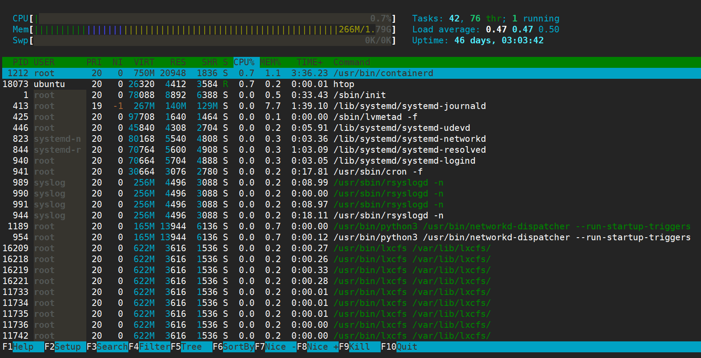
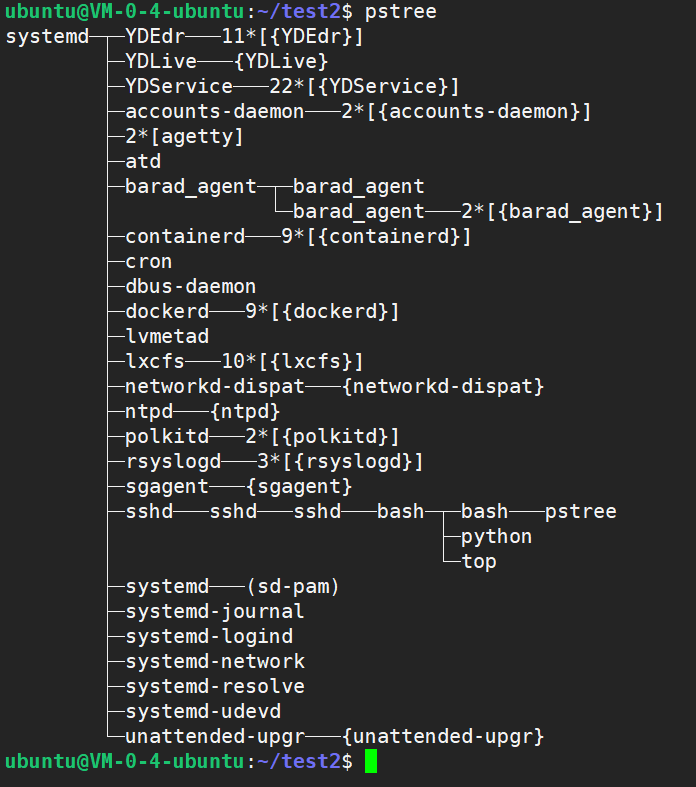
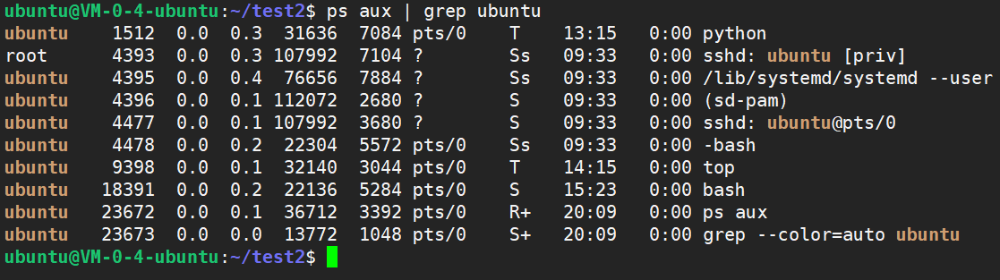
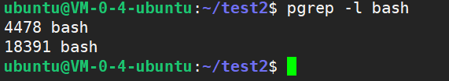
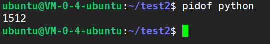

# Linux查看系统进程


<!--more-->

> 进程是在 `CPU` 及内存中运行的程序代码，而每个进程可以创建一个或多个进程（父子进程）

在`linux`中可能不明显，但是`windows`系统中的**任务管理器**大家应该都很熟悉：



在`linux`中查看系统进程的命令有不少，以下是一些常用命令。

#### ps命令

> `ps (process status)` 命令是 `Linux` 下最常用的进程查看工具。使用该命令可以确定哪些进程正在运行和运行的状态、进程是否结束、有没有僵尸进程、哪些进程占用了过多的资源等等。
>
> 注意：`ps` 命令工具显示的是进程的**瞬间状态**（相当于截图），并不是动态连续显示。

主要的参数：`[aux]`

- `a`：显示当前终端下的所有进程信息，包括其他用户的进程。
- `u`：使用以用户为主的格式输出进程信息。
- `x`：显示当前用户在所有终端下的进程。





- `USER`：启动该进程的用户账号名称
- `PID`：该进程的 唯一`ID` 号
- `%CPU`：`CPU` 占用的百分比
- `%MEM`：内存占用的百分比
- `VSZ`：占用虚拟内存（`swap` 空间）的大小
- `RSS`：占用常驻内存（物理内存）的大小
- `TTY 或 TT`：表示该进程在哪个终端上运行。不是从终端启动的进程或与终端机无关的进程则显示为 `？` 
- `STAT`：显示了进程当前的状态。如以下：
  - `D` 不可中断的休眠。通常是 `IO`。
  - `R` 运行。正在运行或者在运行队列中等待。
  - `S` 休眠。在等待某个事件，信号。
  - `T` 停止。进程接收到信息 `SIGSTOP，SIGSTP，SIGTIN，SIGTOU` 信号。
  - `X` 死掉的进程，不应该出现。
  - `Z` 僵死进程。对发现处于僵死状态的进程应予以手动终止。
  - 通常还会跟随如下字母表示更详细的状态：
    - `<` 高优先级
    - `N` 低优先级
    - `L` 有 `pages` 在内存中 `locked`。用于实时或者自定义 `IO`。
    - `s` 进程领导者，其有子进程。
    - `l` 多线程
    - `+`位于前台进程组
- `START`：启动该进程的时间
- `TIME`：该进程占用 `CPU` 时间
- `COMMAND`：启动该进程的命令的名称

总结：`ps aux` 是以简单列表的形式显示出进程信息。



此外，还有另外一种方式：`-[elf]`

- `-e`：显示系统内的所有进程信息。
- `-l`：使用长（long）格式显示进程信息。
- `-f`：使用完整的（full）格式显示进程信息。



`PPID` 为父进程的 `PID`



`ps -ef` 是用标准的格式显示进程，显示的项目有：`UID, PID, PPID, C, STIME, TTY, TIME, CMD` 字段 

`ps aux` 是用 `BSD` 的格式来显示进程，显示的项目有：`USER, PID, % CPU, %MEM, VSZ, RSS, TTY, STAT, START, TIME, COMMAND `
字段

所示：

1. **如果想查看进程的 `CPU` 占用率和内存占用率，可以使用 `aux`** 
2. **如果想查看进程的父进程 `ID` 和完整的 `COMMAND` 命令，可以使用 `-ef`**



#### top命令

> 以全屏交互式的界面显示进程排名，及时跟踪包括 CPU、内存等系统资源占用情况，默认情况下每三秒刷新一次，其作用基本类似于 **Windows 系统中的任务管理器**。





- `Tasks`（系统任务）信息：
  - `total`：总进程数；
  - `running`：正在运行的进程数；
  - `sleeping`：休眠的进程数；
  - `stopped`：中止的进程数；
  - `zombie`：僵死无响应的进程数。
- `CPU` 信息：
  - `us`：用户占用；
  - `sy`：内核占用；
  - `ni`：优先级调度占用；
  - `id`：空闲 `CPU`；
  - `wa`：I/O 等待占用；
  - `hi`：硬件中断占用；
  - `si`：软件中断占用；
  - `st`：虚拟化占用。
- `Mem`（内存）信息：
  - `total`：总内存空间；
  - `used`：已用内存；
  - `free`：空闲内存；
  - `buffers`：缓存区域。
- `Swap`（交换空间）信息：
  - `total`：总交换空间；
  - `used`：已用交换空间；
  - `free`：空闲交换空间；
  - `cached`：缓存空间。

**了解空闲的 `CPU` 百分比，主要看 `% id` 部分。**



#### htop命令

> `htop` 与 `top` 很类似，但是 `htop` 是交互式的文本模式的进程查看器。它通过文字图形化地显示每一个进程的 `CPU` 和内存使用量、`swap` 使用量。使用上下光标键选择进程，`F7` 和 `F8` 改变优先级，`F9` 杀死进程。



#### pstree命令

> `linux` 中，每一个进程都是由其父进程创建的。此命令以可视化方式显示进程，通过显示进程的树状图来展示进程间关系。



可用参数：

- `-a`：显示每个程序的完整指令，包含路径，参数或是常驻服务的标示；
- `-c`：不使用精简标示法；
- `-G`：使用 VT100 终端机的列绘图字符；
- `-h`：列出树状图时，特别标明现在执行的程序；
- `-H` <程序识别码>：此参数的效果和指定 "-h" 参数类似，但特别标明指定的程序；
- `-l`：采用长列格式显示树状图；
- `-n`：用程序识别码排序。预设是以程序名称来排序；
- `-p`：显示程序识别码；
- `-u`：显示用户名称；

#### 优化使用

在实际的使用过程中，单纯上述命令的返回结果真的是让人看的眼都花了……

其实我们根本不需要那么详细或者那么全面的进程信息，可能我们只在意**某个进程的某个信息**……

##### 1-grep

使用管道符`|`配合`grep`字符串匹配，定位到含有特定字符的进程

```
ps aux | grep ubuntu
```



可通过`kill -s 9 [pid]`强制杀死进程。

##### 2-pgrep

`pgrep` 的 `p` 表明了这个命令是专门用于进程查询的 `grep`，`pgrep` 是通过程序的名字来查询进程的工具，一般是用来判断程序是否正在运行。

参数：

```
--help 
	显示帮助文档
--version 
	显示命令版本
-d delimiter
	设置用于分隔输出中每个进程ID的字符串(默认为换行符)。(仅限于pgrep)
-f
	查找完成的文件名
-g pgrp
	只匹配列出的进程组ID中的进程。进程组0被转换为pgrep或pkill自己的进程组。
-G gid
	只匹配实际组ID列出的进程。可以使用数值或符号值。
-l
	列出进程的名字和id
-n
	选择最近执行的进程
-o
	选择最早的进程
-P ppid
	选择父pid匹配的进程
-s sid
	只匹配进程会话ID列出的进程。会话ID 0被转换为pgrep或pkill自己的会话ID。
-t term
	查找符合终端号的进程
-u euid
	只匹配其有效用户ID列出的进程。
-U uid
	只匹配实际用户ID列出的进程。可以使用数值或符号值。
-v
	查找不符合条件的进程
-x
	只匹配其名称(如果-f指定了命令行)与模式完全匹配的进程。
```

如列出进程的`名字和 id`

```
pgrep -l bash
```



##### 3-pidof

直接查询某个进程的`pid`，但是需要知道进程的全名


