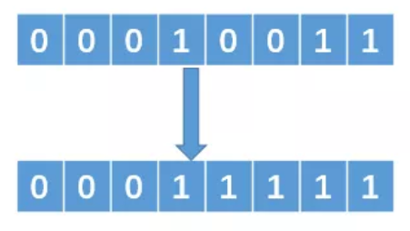

# Python位运算


<!--more-->

## Python位运算符

> **按位运算符是把数字看作二进制来进行计算的**

Python中的按位运算法则如下：下表中变量 a 为 60，b 为 13

```python
a = 0011 1100
b = 0000 1101
-----------------
a&b = 0000 1100
a|b = 0011 1101
a^b = 0011 0001
~a  = 1100 0011
```

| 运算符 | 描述                                                         | 实例                                                         |
| :----- | :----------------------------------------------------------- | :----------------------------------------------------------- |
| &      | 按位与运算符：参与运算的两个值,如果两个相应位都为1,则该位的结果为1,否则为0 | `(a & b)` 输出结果 12 ，二进制解释： 0000 1100               |
| \|     | 按位或运算符：只要对应的二个二进位有一个为1时，结果位就为1   | `(a \| b)` 输出结果 61 ，二进制解释： 0011 1101              |
| ^      | 按位异或运算符：当两对应的二进位相异时，结果为1              | `(a ^ b)` 输出结果 49 ，二进制解释： 0011 0001               |
| ~      | 按位取反运算符：对数据的每个二进制位取反,即把1变为0,把0变为1 | `(~a )` 输出结果 -61 ，二进制解释： 1100 0011，在一个有符号二进制数的补码形式。 |
| <<     | 左移动运算符：运算数的各二进位全部左移若干位，由 **<<** 右边的数字指定了移动的位数，高位丢弃，低位补0。 | `a << 2` 输出结果 240 ，相当于a*2^2二进制解释： 1111 0000    |
| >>     | 右移动运算符：把">>"左边的运算数的各二进位全部右移若干位，**>>** 右边的数字指定了移动的位数 | `a >> 2` 输出结果 15 ，相当于a/2^2二进制解释： 0000 1111     |

## 应用实例

### 1 交换两个变量

```python
# 两个相同的数异或之后结果会等于 0，即 n ^ n = 0。并且任何数与 0 异或等于它本身，即 n ^ 0 = n。
x = x ^ y   // （1）
y = x ^ y   // （2）
x = x ^ y   // （3）
```

### 2 判断奇偶数

```python
n & 1 == 1  与 n % 2 类似
```

### 3 找出没有重复的数

> 给一组整型数据，这些数据中，其中有一个数只出现了一次，其他的数都出现了两次，让你来找出一个数 。

思想：两个相同的数异或的结果是 0，一个数和 0 异或的结果是它本身，所以我们把这一组整型全部异或一下

```python 
lst = [1, 2, 3, 3, 4, 4, 2, 1, 5, 5, 6]
def unique(lst):
    temp = lst[0]
    for i in range(1, len(lst)):
        temp ^= lst[i]
    return temp
print(unique(lst))
```

### 4 m的n次方

1、直接用`pow`函数

```python
# math模块
import math

math.pow(x, y)
------------------------------
#　内置的pow()方法
pow(x, y[, z])
#　函数是计算x的y次方，如果z在存在，则再对结果进行取模
#　其结果等效于pow(x,y) %z
```



pow() 通过内置的方法直接调用，内置方法会把参数作为整型，而 math 模块则会把参数转换为 float。



2、循环

```python 
def powxy(x, y):
    tmp = 1
    for i in range(y):
        tmp *= x
    return tmp
```

时间复杂度为 O(n)，有没有其他优化的方法呢？

3、位运算

- 把n转成二进制，如n=9，——>1001，求m的9次方，
- 即m^9 = m^1000 * m^0001，所以只需要把是1的乘数累积到结果中
- 如2^9，拆分为1000，0001（8,1）

```python
def powerXn(x, n):
    result = 1
    temp = x
    while n != 0:
        if n & 1 == 1:
            result *= temp
        temp *= temp
        n >>= 1
    return result
```

4、递归

递归计算幂方，二分优化，2^6 = 2\^3*2^3，故可以二分求幂

```python
def powerXn(x, n):
    if n == 0:
        return 1
    else:
        temp = powerX1(x, n//2)
        result = temp * temp
        if n % 2 == 1:
            result *= x
        return result
```

### 5 不大于N的最大2的幂指数

传统的做法就是让1不断着乘以 2，代码如下：

```python 
def findN(n):
    sum = 1
    while True:
        if sum * 2 > n:
            return sum
        sum *= 2
```

时间复杂度是O(logn)，还有其他优化的方法吗？

采用位运算：例如 N = 19，那么转换成二进制就是 00010011。那么我们要找的数就是，把二进制中**最左边的1保留，后面的 1 全部变为 0**。即我们的目标数是 00010000

- 1、找到最左边的 1，然后把它右边的所有 0 变成 1



- 2、把得到的数值加 1，可以得到 00100000即 00011111 + 1 = 00100000。

- 3、把得到的 00100000 向右移动一位，即可得到 00010000，即 00100000 >> 1 = 00010000。

具体的做法为：

```python
n |= n >> 1
n |= n >> 2
n |= n >> 4
n |= n >> 8
```

我们假设最左边的 1 处于二进制位中的第 k 位(从左往右数),那么把 n 右移一位之后，那么得到的结果中第 k+1 位也必定为 1,然后把 n 与右移后的结果做或运算，那么得到的结果中第 k 和 第 k + 1 位必定是 1;同样的道理，再次把 n 右移两位，那么得到的结果中第 k+2和第 k+3 位必定是 1,然后再次做或运算，那么就能得到第 k, k+1, k+2, k+3 都是 1，如此往复下去….

完整代码：

```python
def findN(n):
    n |= n >> 1
    n |= n >> 2
    n |= n >> 4
    n |= n >> 8
	return(n+1) >> 1
```

### 6 输出集合的子集

以`lst = [1,2,3,4]`为例，将子集与二进制映射。可以发现，所有子集其实就是所有元素位置为`1或0`的排列。我们知道`len(lst)=N`的集合子集总数为`2^N`个，而`list(range(2^N))`正好一一对应所有子集为`1或0`的排列。

```
0 [] --> 0000
1 [1] --> 0001
2 [2] --> 0010
3 [1, 2] --> 0011
4 [3] --> 0100
5 [1, 3] --> 0101
6 [2, 3] --> 0110
7 [1, 2, 3] --> 0111
8 [4] --> 1000
9 [1, 4] --> 1001
10 [2, 4] --> 1010
11 [1, 2, 4] --> 1011
12 [3, 4] --> 1100
13 [1, 3, 4] --> 1101
14 [2, 3, 4] --> 1110
15 [1, 2, 3, 4] --> 1111
```

具体的代码：

```python
def findsubsets(lst):
    N = len(lst)
    for i in range(2 ** N):#子集的个数
        subset = []
        for j in range(N):#用来判断二进制数的下标为j的位置的数是否为1
            if (i >> j) & 1:
                subset.append(lst[j])
        print(subset)
```


