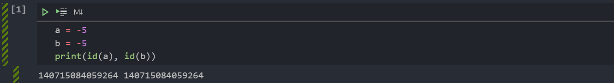

# Python内存管理机制


<!--more-->

> python 中万物皆对象，所以 python 的存储问题是对象的存储问题，并且对于每个对象，python 会分配一块内存空间去存储它。
>
> 简单来说，python 内存管理机制总结为：
>
> 1. 垃圾回收
> 2. 内存池机制
> 3. 对象缓冲池机制

## 1 垃圾回收

### 1.1 引用计数

引用计数是一种非常高效的内存管理手段。当一个 Python 对象被引用时，其引用计数增加 1；当其不再被一个变量引用时，则计数减 1；当引用计数等于 0 时对象被删除。

**引用计数增加的情况：**

- 创建一个对象，例例如:`a = 'carry'`, 引用计数 1。
- 赋值 `b=a`, 引用计数加 1
- 浅拷贝、函数的传参 `foo (x)` 等
- 作为容器对象的一个元素:`a=[1,x,22]`

**引用计数减少的情况：**

- 一个本地引用离开了它的作用域。比如上面 `foo (x)` 函数结束时，`x` 指向的对象引用减 1。
- 对象的别名被显式的销毁:`del x` ; 或者 `del y`
- 对象的一个别名被赋值给其他对象:`x = 123`
- 对象从一个窗口对象中移除:`carry.remove (x)`
- 窗口对象本身被销毁:`del carry`，或者窗口对象本身离开了作用域。



优点：

- 简单、实时性：只用引用计数为 0，内存就直接释放了，不受时间限制。

缺点：

- 维护引用计数消耗资源
- 容器对象出现循环引用

出现了了**循环引用**怎么办 ?--> `标记-清除、分代回收`

循环引用的例子：

```python
a = [1]
b = [2]
a.append(b)
b.append(a)
```



### 1.2 标记-清除

标记清除 `Mark-Sweep` 是针对循环引用问题的回收机制，作用的对象是**容器类型**的对象 (比如:`list、set、dict` 等)。

**原理**：通过根节点对象 (不会被删除的对象) ，根据引用指向方向，把所有活动对象（可遍历到的）打上标记，然后回收没有被标记的非活动对象（循环引用小团体）。

> 『标记清除（Mark—Sweep）』算法是一种基于追踪回收（tracing GC）技术实现的垃圾回收算法。它分为两个阶段：第一阶段是标记阶段，GC 会把所有的『活动对象』打上标记，第二阶段是把那些没有标记的对象『非活动对象』进行回收。具体过程如下：
>
> 对象之间通过引用（指针）连在一起，构成一个有向图，对象构成这个有向图的节点，而引用关系构成这个有向图的边。从根对象（root object）出发，沿着有向边遍历对象，可达的（reachable）对象标记为活动对象，不可达的对象就是要被清除的非活动对象。根对象就是全局变量、调用栈、寄存器。



在上图中，把小黑圈作为全局变量，也就是`root object`，从小黑圈出发，对象1可直达，那么就被标记，对象2、3可间接到达，也被标记。而4和5不可达，**那么1、2、3就是活动对象，4和5就是非活动对象**，被GC回收。

> 标记-清除算法作为 Python 的辅助垃圾收集技术，主要处理的是一些容器对象，因为对于字符串、数值对象是不可能造成循环引用问题。Python 使用一个双向链表将这些容器对象组织起来。不过，这种简单粗暴的标记清除算法也有明显的**缺点：清除非活动的对象前它必须顺序扫描整个堆内存，哪怕只剩下小部分活动对象也要扫描所有对象。**

### 1.3 分代回收

**分代回收**是建立在**标记清除**基础上的一种辅助回收容器器对象的 GC 机制。主要原因是**每次标记清除的时间成本太高**。

无论开发的程序类型如何，规模如何，都有这样的相同之处：一些比例的内存生存周期都很短，而另一些内存的生存周期比较长，可能会伴随着整个程序的开始和结束。

所以分代回收就根据系统中内存存活时间把它们划分成不同的集合：**一共分成三个集合，每个集合称为一个代**。第一代未被回收就会进入第二代，同理第二代未被回收就会进入第三代，它们的垃圾收集频率随对象存活时间的增大而减小。

也就是说：**对于存活时间越长的对象，就越不可能是垃圾，减少对其的收集频率**。而新创建的对象都在第一代，第一代集合总数达到上限后，会触发 GC 机制：可以回收的对象所占的内存被释放，不能被回收的移到下一代。

## 2 内存池机制

Python 在运行期间会大量地执行 `malloc` 和 `free` 的操作，频繁地在用户态和核心态之间进行切换，这将严重影响 Python 的执行效率。为了加速 Python 的执行效率，Python 引入了一个内存池机制，用于管理对小块内存的申请和释放。

> 内存池是预先从内存中申请的内存块。**当创建小于 256字节的对象时，从内存池申请内存空间；大于 256字节的对象从内存申请空间** 。释放内存时，来自内存池空间的内存空间返回给内存池。这样做的目的是为了**减少内存碎片，提升效率**。

如下图所示，Python 的内存机制呈现金字塔形状：

- 第 **`3`** 层是最上层，也就是我们对 Python 对象的直接操作；

- 第 **`2`** 层和第 **`1`** 层是内存池，当对象小于 256K 时有该层直接分配内存；
  - 由 python 的接口函数 `Pymem_Malloc` 实现，若请求的内存在 `1~256` 字节之间就使用内存池管理系统进行分配。调用 malloc 函数分配内存，但是每次只会分配一个 256K 大小的内存，并且不会使用 free 函数释放，方便下次使用。
- 第 **`0`** 层是 C 中的 malloc，free 等内存分配和释放函数进行操作；
- 第`-1、-2`层主要有操作系统进行操作。



通过修改 Python 源代码，我们可以改变这个默认值（256K），从而改变 Python 的默认内存管理行为。

调优手段（了解）

1. 手动垃圾回收
2. 调高垃圾回收阈值
3. 避免循环引用（手动解循环引用和使用弱引用）

## 3 对象缓冲池机制

> 对于固定范围整数和短小的字符等，python 会执行缓存机制，即将这些对象进行缓存，不会为相同的对象分配多个内存空间。

例如，对于 `[-5,257)` 这样的小整数，系统已经初始化好，可以直接拿来用。

虽然整数是不可变类型，但是图中`a、b`的地址明显相同。


