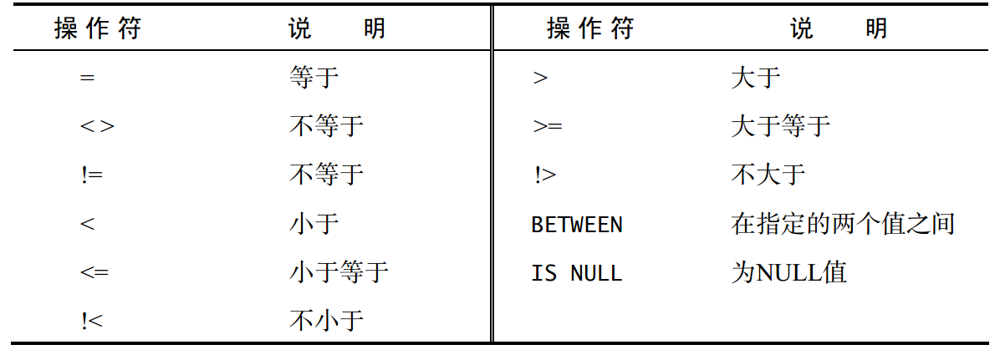
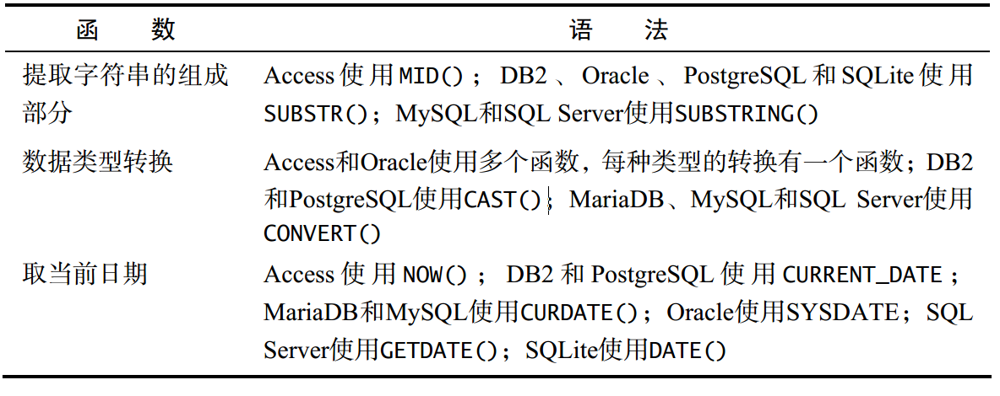

# SQL学习


<!--more-->

## 1、了解SQL

> **SQL：Structured Query Language（结构**
> **化查询语言）的缩写。 SQL 是一种专门用来与数据库沟通的语言。**

 

   主键（primary key）：
一列（或一组列），其值能够唯一标识表中每一行。

- 任意两行都不具有相同的主键值；
- 每一行都必须具有一个主键值（主键列不允许 NULL 值）；
- 主键列中的值不允许修改或更新；
- 主键值不能重用（如果某行从表中删除，它的主键不能赋给以后的新行）。



## 2、检索数据

```sql
select column_name1, column_name2, ...  -- '*'用来检索所有列
from table  -- SQL 语句不区分大小写

-- distinct column_name 检索去重后的结果
注意：不能部分使用 DISTINCT
DISTINCT 关键字作用于所有的列，不仅仅是跟在其后的那一列。例
如，你指定 SELECT DISTINCT vend_id, prod_price，除非指定的
两列完全相同，否则所有的行都会被检索出来。

-- limit m, n 表示从m+1行开始，偏移n行
MySQL和 MariaDB支持简化版的 LIMIT 4 OFFSET 3 语句，即 LIMIT 3,4。
使用这个语法，逗号之前的值对应 OFFSET，逗号之后的值对应 LIMIT。
第一个被检索的行是第 0 行，而不是第 1 行。因此， LIMIT 1 OFFSET 1 会检索第 2 行，而不是第 1 行。
```

## 3、排序检索数据

```sql
order by
注意： ORDER BY 子句的位置
在指定一条 ORDER BY 子句时，应该保证它是 SELECT 语句中最后一条子句

按多个列排序
order by column_name1, column_name2 
仅在多个行具有相同的 column_name1 值时才对产品按 column_name2 进行排序。如果 column_name1 列中所有的值都是唯一的，则不会按 column_name2 排序。
多个列排序时还可以采用相对位置来排序，order by 2, 3 -- 2,3代表第2列和第3列

排序
默认：ASC，升序排列
DESC 关键字只应用到直接位于其前面的列名，如果想在多个列上进行降序排序，必须对每一列指定 DESC 关键字。
```

## 4、过滤数据

```sql
在 SELECT 语句中，数据根据 WHERE 子句中指定的搜索条件进行过滤
在同时使用 ORDER BY 和 WHERE 子句时，应该让 ORDER BY 位于WHERE 之后

范围内查询 between ... and ... -- 数值或者日期范围内查询
select column_name1, column_name2
from table 
where column_name2 between 5 and 10;
-- BETWEEN 匹配范围中所有的值，包括指定的开始值和结束值。
确定值是否为 NULL，不能简单地检查是否= NULL， 用is null 判断
```



## 5、高级数据过滤

```sql
组合where语句：
SQL 允许给出多个 WHERE 子句。这些子句有两种使用方式，即以 AND 子句或 OR 子句的方式使用， and优先级高
IN 操作符后跟由逗号分隔的合法值，这些值必须括在圆括号中
```

 

为什么要使用 IN 操作符？其优点如下

- 在有很多合法选项时， IN 操作符的语法更清楚，更直观。
- 在与其他 AND 和 OR 操作符组合使用 IN 时，求值顺序更容易管理。
- IN 操作符一般比一组 OR 操作符执行得更快。
- IN 的最大优点是可以包含其他 SELECT 语句，能够更动态地建立
  WHERE 子句。

 

## 6、用通配符进行过滤

```sql
匹配like开头的字符
like 'like%' 
%代表搜索模式中给定位置的 0 个、 1 个或多个字符。

注意：
NULL通配符%看起来像是可以匹配任何东西，但有个例外，这就是 NULL。
子句 WHERE prod_name LIKE '%' 不会匹配产品名称为 NULL 的行。
另一个有用的通配符是下划线（ _）。
下划线的用途与%一样，但它只匹配单个字符，而不是多个字符。
-- 说明：Access 通配符如果使用的是 Microsoft Access，需要使用 ?而不是_。

方括号（ [] ）通配符用来指定一个字符集，它必须匹配指定位置（通配符的位置）的一个字符。
说明：并不总是支持集合与前面描述的通配符不一样，并不是所有 DBMS 都支持用来创建集合的[]。
只有微软的 Access 和 SQL Server 支持集合。
WHERE cust_contact LIKE '[JM]%' -- 找出所有名字以 J 或 M 起头的联系人
此通配符可以用前缀字符 ^（脱字号）来否定。
例如，下面的查询匹配以J 和 M 之外的任意字符起头的任意联系人名（与前一个例子相反）
WHERE cust_contact LIKE '[ ^JM]%' -- 以J 和 M 之外的任意字符起头的任意联系人名
可以用not 代替 WHERE NOT cust_contact LIKE '[JM]%'
```

 

- 不要过度使用通配符。如果其他操作符能达到相同的目的，应该使用
  其他操作符。
- 在确实需要使用通配符时，也尽量不要把它们用在搜索模式的开始处。把通配符置于开始处，搜索起来是最慢的。
- 仔细注意通配符的位置。如果放错地方，可能不会返回想要的数据。

 

## 7、创建计算字段

```sql
将值联结到一起（将一个值附加到另一个值）构成单个值。
根据你所使用的 DBMS，此操作符可用加号（ +）或两个竖杠（ || ）表示。
在 MySQL 和 MariaDB 中，必须使用特殊的函数。
-- Access 和 SQL Server 使用 +号。 DB2、 Oracle、 PostgreSQL、 SQLite 和Open Office Base 使用 || 
如：
SELECT vend_name + ' (' + vend_country + ')' --或 SELECT vend_name || ' (' || vend_country || ')'
FROM Vendors
ORDER BY vend_name;

下面是使用 MySQL 或 MariaDB 时需要使用的语句：
SELECT Concat(vend_name, ' (', vend_country, ')') -- 按顺序放在concat函数内
FROM Vendors
ORDER BY vend_name;
--大多数 DBMS 都支持 RTRIM()（正如刚才所见，它去掉字符串右边的空格）
--LTRIM()（去掉字符串左边的空格）
--以及 TRIM()（去掉字符串左右两边的空格
```

## 8、使用函数处理数据



```sql
UPPER()将文本转换为大写
LEFT()（或使用子字符串函数） 返回字符串左边的字符
LENGTH()（也使用DATALENGTH()或LEN()） 返回字符串的长度
LOWER()（ Access使用LCASE()） 将字符串转换为小写
LTRIM() 去掉字符串左边的空格
RIGHT()（或使用子字符串函数） 返回字符串右边的字符
RTRIM() 去掉字符串右边的空格
SOUNDEX() 返回字符串的SOUNDEX值 --发音相似 WHERE SOUNDEX(cust_contact) = SOUNDEX('Michael Green')
UPPER()（ Access使用UCASE()） 将字符串转换为大写

日期：WHERE strftime('%Y', order_date) = '2012';

ABS() 返回一个数的绝对值
COS() 返回一个角度的余弦
EXP() 返回一个数的指数值
PI() 返回圆周率
SIN() 返回一个角度的正弦
SQRT() 返回一个数的平方根
TAN() 返回一个角度的正切
```

## 9、汇总数据

```sql
AVG() 返回某列的平均值 -- AVG()函数忽略列值为 NULL 的行

COUNT() 返回某列的行数 
-- 使用 COUNT(*)对表中行的数目进行计数，不管表列中包含的是空值（ NULL）还是非空值。
-- 使用 COUNT(column)对特定列中具有值的行进行计数， 忽略 NULL 值

MAX() 返回某列的最大值 -- MAX()函数忽略列值为 NULL 的行
MIN() 返回某列的最小值 -- MIN()函数忽略列值为 NULL 的行
SUM() 返回某列值之和 -- 如SELECT SUM(item_price*quantity) AS total_price， SUM()函数忽略列值为 NULL 的行
```

## 10、分组数据

```sql
GROUP BY 子句和 HAVING 子句
如果分组列中包含具有 NULL 值的行，则 NULL 将作为一个分组返回。如果列中有多行 NULL 值，它们将分为一组

WHERE 在数据分组前进行过滤， HAVING 在数据分组后进行过滤，WHERE 排除的行不包括在分组中
```

## 11、使用子查询

```sql
SELECT cust_id
FROM Orders
WHERE order_num IN (SELECT order_num -- WHERE order_num IN (20007,20008)
                    FROM OrderItems
                    WHERE prod_id = 'RGAN01');

对于检索出的每个顾客，统计其在 Orders 表中的订单数目
SELECT cust_name,
 cust_state,
 (SELECT COUNT(*)
 FROM Orders
 WHERE Orders.cust_id = Customers.cust_id) AS orders
FROM Customers
ORDER BY cust_name;
```

## 12、联结表

```sql
可以联结多个表返回一组输出，联结在运行时关联表中正确的行
子查询可以用联接表实现，联接表需要注意where条件语句，否则返回为笛卡尔积
SELECT prod_name, vend_name, prod_price, quantity
FROM OrderItems, Products, Vendors
WHERE Products.vend_id = Vendors.vend_id
 AND OrderItems.prod_id = Products.prod_id
 AND order_num = 20007;
```

## 13、创建高级联接

```sql
子查询：
SELECT cust_id, cust_name, cust_contact
FROM Customers
WHERE cust_name = (SELECT cust_name
 FROM Customers
 WHERE cust_contact = 'Jim Jones')

联接查询：
SELECT c1.cust_id, c1.cust_name, c1.cust_contact
FROM Customers AS c1, Customers AS c2
WHERE c1.cust_name = c2.cust_name
 AND c2.cust_contact = 'Jim Jones';
```

## 14、组合查询

```sql
利用 UNION 操作符将多条 SELECT 语句组合成一个结果集

SELECT cust_name, cust_contact, cust_email
FROM Customers
WHERE cust_state IN ('IL','IN','MI')
UNION
SELECT cust_name, cust_contact, cust_email
FROM Customers
WHERE cust_name = 'Fun4All';

--使用 UNION 时，重复的行会被自动取消。使用 UNION ALL， DBMS 不取消重复的行
```

 

- UNION 必须由两条或两条以上的 SELECT 语句组成，语句之间用关键
  字 UNION 分隔（因此， 如果组合四条 SELECT 语句，将要使用三个 UNION
  关键字）。
- UNION 中的每个查询必须包含相同的列、表达式或聚集函数（不过，
  各个列不需要以相同的次序列出）。
- 列数据类型必须兼容：类型不必完全相同，但必须是 DBMS 可以隐含
  转换的类型（例如，不同的数值类型或不同的日期类型）

 

## 15、数据插入

```sql
insert into table(a, b, c) values('xx', 'xx', 'xx')

INSERT INTO Customers
VALUES('1000000006',
 'Toy Land',
 '123 Any Street',
 'New York',
 'NY',
 '11111',
 'USA',
 NULL,
 NULL);
 
--提示：插入多行
INSERT 通常只插入一行。要插入多行，必须执行多个 INSERT 语句。
INSERT SELECT是个例外，它可以用一条 INSERT插入多行，不管 SELECT语句返回多少行，都将被 INSERT 插入

select * into b from a  -- 把a数据复制到b
```

## 16、更新和删除数据

   利用 UPDATE 和 DELETE 语句进一步操作表数据

```sql
update table set xx=xx where ...
UPDATE Customers
SET cust_email = 'kim@thetoystore.com'
WHERE cust_id = '1000000005';

--删除一行
DELETE FROM Customers WHERE cust_id = '1000000006';
DELETE 语句从表中删除行，甚至是删除表中所有行。但是， DELETE不删除表本
--删除一列
alter table 表名 drop column 列名
```

## 17、创建和操纵表

```sql
create table table_name(
column_name1 type,
column_name2 type,
    ...
);

CREATE TABLE Products
(
 prod_id CHAR(10) NOT NULL,
 vend_id CHAR(10) NOT NULL,
 prod_name CHAR(254) NOT NULL,
 prod_price DECIMAL(8,2) NOT NULL,
 prod_desc VARCHAR(1000) NULL
);

更改表结构
增加一列：ALTER TABLE VendorsADD vend_phone CHAR(20);
删除一列：ALTER TABLE Vendors DROP COLUMN vend_phone;
删 除 表：DROP TABLE CustCopy；
重命名表：rename table old_name to new_name;
```

## 18、使用视图

视图仅仅是用来查看存储在别处数据的一种设施。视图本身不包含数据，因此返回的数据是从其他表中检索出来的。在添加或更改这些表中的数据时，视图将返回改变过的数据

```sql
注意：性能问题
因为视图不包含数据，所以每次使用视图时，都必须处理查询执行时需要的所有检索。
如果你用多个联结和过滤创建了复杂的视图或者嵌套了视图，性能可能会下降得很厉害。
因此，在部署使用了大量视图的应用前，应该进行测试。

1、与表一样，视图必须唯一命名（不能给视图取与别的视图或表相同的名字）
2、对于可以创建的视图数目没有限制
3、视图不能索引，也不能有关联的触发器或默认值

视图用 CREATE VIEW 语句来创建
DROP VIEW viewname 删除视图
视图一般是一个复杂的sql查询 -- create view view_name as select ......
CREATE VIEW ProductCustomers AS
SELECT cust_name, cust_contact, prod_id
FROM Customers, Orders, OrderItems
WHERE Customers.cust_id = Orders.cust_id
 AND OrderItems.order_num = Orders.order_num;
 
视图为虚拟的表。它们包含的不是数据而是根据需要检索数据的查询。
视图提供了一种封装 SELECT 语句的层次，可用来简化数据处理，
重新格式化或保护基础数据
```

## 19、使用存储过程

存储过程思想上很简单，就是数据库 SQL 语言层面的代码封装与重用。

- 存储过程可封装，并隐藏复杂的商业逻辑。
- 存储过程可以回传值，并可以接受参数。
- 存储过程无法使用 SELECT 指令来运行，因为它是子程序，与查看表，数据表或用户定义函数不同。
- 存储过程可以用在数据检验，强制实行商业逻辑等

## 20、事务管理

- 事务（ transaction）指一组 SQL 语句；
- 回退（ rollback）指撤销指定 SQL 语句的过程；
- 提交（ commit）指将未存储的 SQL 语句结果写入数据库表；
- 保留点（ savepoint）指事务处理中设置的临时占位符（ placeholder），
  可以对它发布回退（与回退整个事务处理不同）。

> 使用简单的 ROLLBACK 和 COMMIT 语句，就可以写入或撤销整个事务。但
> 是，只对简单的事务才能这样做，复杂的事务可能需要部分提交或回退。在 SQL 中，这些占位符称为保留点。在 MariaDB、 MySQL 和 Oracle 中
> 创建占位符，可使用 SAVEPOINT 语句。

```sql
.......
savepoint my_savepoint1
.......
savepoint my_savepoint2
.......
rollback to my_savepoint1
```

## 21、使用游标

> **游标是面向集合与面向行的设计思想之间的一种桥梁**，主要**用在循环处理、存储过程、函数中使用**，用来查询结果集

游标的使用一般分为 5 个步骤，主要是：**定义游标 -> 打开游标 -> 使用游标 -> 关闭游标 -> 释放游标**。

（1）定义游标

```sql
语法为：
DECLARE <游标名> CURSOR FOR select语句;

具体例子：
DECLARE mycursor CURSOR FOR select * from shops_info; 
-- 这样游标就对select语句声明了一个游标
```

（2）打开游标

```sql
open <游标名>
```

（3）使用游标

使用游标需要用关键字 `fetch` 来取出数据，然后取出的数据需要有存放的地方，我们需要用 declare 声明变量存放列的数据其语法格式为：

```sql
declare 变量1 数据类型(与列值的数据类型相同)
declare 变量2 数据类型(与列值的数据类型相同)
declare 变量3 数据类型(与列值的数据类型相同)
FETCH [NEXT | PRIOR | FIRST | LAST] FROM <游标名> [ INTO 变量名1,变量名2,变量名3[,…] ]

NEXT：
取下一行的数据，游标一开始默认的第一行之前，
故要让游标指向第一行，就必须第一次就执行 FETCH NEXT 操作

INTO：将一行中每个对应的列下的数据放到与列 的数据类型相同的变量中。

-- 声明四个变量
declare id varchar(20);
declare pname varchar(20);
declare pprice varchar(20);
declare pdescription varchar(20);
```

总结：

```sql
1、定义一个游标mycursor
	declare mycursor cursor forselect *from shops_info;

2、打开游标：
	open mycursor;

3、使用游标获取列数据放入变量中
	fetch  next from mycursor into id,pname,pprice,pdescription;

4、关闭游标：很简单的使用语句：
	close mycursor;

5、释放游标：
	deallocate mycursor;
```

## 22、高级SQL特性

   高级数据处理特性： 约束、 索引和触发器

```sql
检查约束
CREATE TABLE OrderItems
(
 order_num INTEGER NOT NULL,
 order_item INTEGER NOT NULL,
 prod_id CHAR(10) NOT NULL,
 quantity INTEGER NOT NULL CHECK (quantity > 0), --检查保证 quantity大于 0。
 item_price MONEY NOT NULL
);

检查名为 gender 的列只包含 M 或 F，可编写如下的 ALTER TABLE 语句：
ADD CONSTRAINT CHECK (gender LIKE '[MF]')
```

> 触发器是特殊的存储过程，它在特定的数据库活动发生时自动执行。触发
> 器可以与特定表上的 INSERT、 UPDATE 和 DELETE 操作（或组合）相关联。

```sql
sql serve版本：
CREATE TRIGGER customer_state
ON Customers
FOR INSERT, UPDATE
AS
UPDATE Customers
SET cust_state = Upper(cust_state)
WHERE Customers.cust_id = inserted.cust_id;
```

   一般来说，约束的处理比触发器快，因此在可能的时候，应该尽量使用约束。
