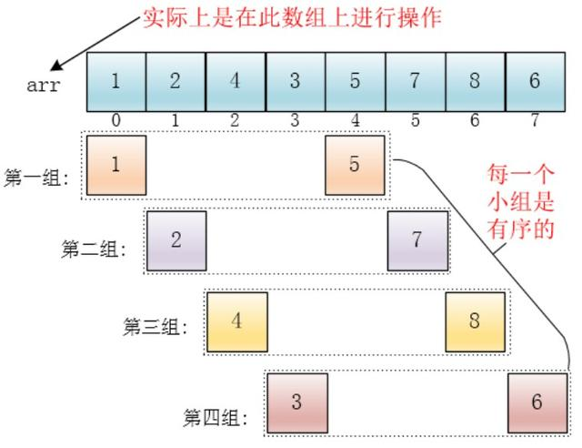
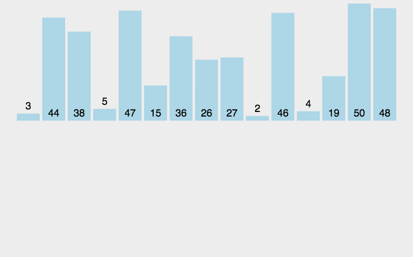

# 经典排序算法


<!--more-->

本文是关于经典排序算法的个人学习记录……，文字部分网上都有，算是~~个人总结~~复制粘贴，重点在代码部分。

## 概述

排序算法是`《数据结构与算法》`中最基本的算法之一。

> 排序算法可以分为内部排序和外部排序，内部排序是数据记录在内存中进行排序，而外部排序是因排序的数据很大，一次不能容纳全部的排序记录，在排序过程中需要访问外存。常见的内部排序算法有：插入排序、希尔排序、选择排序、冒泡排序、归并排序、快速排序、堆排序、基数排序等。

用一张图概括：


#### 关于时间复杂度：

- 平方阶 (O (n2)) 排序 各类简单排序：直接插入、直接选择和冒泡排序；
- 线性对数阶 (O (nlog2n)) 排序 快速排序、堆排序和归并排序；
- O (n1+§)) 排序，§ 是介于 0 和 1 之间的常数。希尔排序；
- 线性阶 (O (n)) 排序 基数排序，此外还有桶、箱排序。

#### **关于稳定性：**

- 排序后 2 个相等键值的顺序和排序之前它们的顺序相同
- 稳定的排序算法：冒泡排序、插入排序、归并排序和基数排序。
- 不是稳定的排序算法：选择排序、快速排序、希尔排序、堆排序。

#### **名词解释：**

- n：数据规模
- k：“桶” 的个数
- In-place：占用常数内存，不占用额外内存，原地算法，仅靠输出覆盖输入，即对原数组进行操作
- Out-place：占用额外内存

## **1 冒泡排序**

> 冒泡排序（Bubble Sort）是一种简单直观的排序算法。它重复地走访过要排序的数列，一次比较两个元素，如果他们的顺序错误就把他们交换过来。走访数列的工作是重复地进行直到没有再需要交换，也就是说该数列已经排序完成。这个算法的名字由来是因为越小的元素会经由交换慢慢 “浮” 到数列的顶端。

#### **（1）算法步骤**

1. 比较相邻的元素。如果第一个比第二个大，就交换他们两个。
2. 对每一对相邻元素作同样的工作，从开始第一对到结尾的最后一对。这步做完后，最后的元素会是最大的数。
3. 针对所有的元素重复以上的步骤，除了最后一个。
4. 持续每次对越来越少的元素重复上面的步骤，直到没有任何一对数字需要比较。

#### **（2）动图演示**


#### **（3）python 代码**

```python
'''前后两个对比，一次排出一个最值放在最后'''
def bubble_sort(arr):
    for i in range(1, len(arr)):
        for j in range(0, len(arr)-i):
            if arr[j] > arr[j+1]:
                arr[j], arr[j+1] = arr[j+1], arr[j]
            else:
                continue
    return arr

```



- 立个flag

```python
'''优化：每次循环后需要监测是否发生了数据交换，如果没有，则可以提前结束排序'''
def bubble_sort_plus(arr):
    for i in range(1, len(arr)):
        flag = True
        for j in range(0, len(arr)-i):
            if arr[j] > arr[j+1]:
                arr[j], arr[j+1] = arr[j+1], arr[j]
                flag = False
            else:
                continue
        if flag:
            break
    return arr
```

- 每次循环时记录最后一次交换的位置

```python 
'''常见的数据中大部分是部分有序，尾部部分有序的数据更多，可以继续优化：
   每次循环时记录最后一次交换的位置，位置之后的说明部分有序，不需要再交换了，只对前面的数据排序'''
def bubble_sort_plus2(arr):
    end = len(arr)
    start = 1
    while start < end:
        sorted_index = 0               #初始值为0是为了已排序列表，保证一次循环就结束
        for j in range(0, end-start):
            if arr[j] > arr[j+1]:
                arr[j], arr[j+1] = arr[j+1], arr[j]
                sorted_index = j+1     #记录截止排序的地方，即后面全是有序列表，
                start = 0              #记录之后，start为0，保证下次循环，end-start可以取到记录之前所有的数
        end = sorted_index             #记录赋值给end，保证while循环次数中去掉记录之后的循环
        start += 1                     #正常循环递增
    return arr
bubble_sort_plus2(arr)
"""冒泡排序算法是稳定，但是如果把比较过程的<写出<=就会导致不稳定"""
```



## 2 选择排序

> 选择排序是一种简单直观的排序算法，无论什么数据进去都是 O (n²) 的时间复杂度。所以用到它的时候，数据规模越小越好。

#### **（1）算法步骤**

1. 首先在未排序序列中找到最小（大）元素，存放到排序序列的起始位置
2. 再从剩余未排序元素中继续寻找最小（大）元素，然后放到已排序序列的末尾。
3. 重复第二步，直到所有元素均排序完毕。

#### **（2）动图演示**


#### （3）python代码

```python
'''每次循环选择剩余数组中的最小值，在左侧排列好'''
def select_sort(arr):
    for i in range(len(arr)):
        min_index = i
        for j in range(i+1, len(arr)):
            if arr[j] < arr[min_index]:
                min_index = j
        if i != min_index:
            arr[i], arr[min_index] = arr[min_index], arr[i]
    return arr
```

## 3 堆排序

> 堆排序（Heapsort）是指利用堆这种数据结构所设计的一种排序算法。堆积是一个近似完全二叉树的结构，并同时满足堆积的性质：即子结点的键值或索引总是小于（或者大于）它的父节点。堆排序可以说是一种利用堆的概念来排序的选择排序。分为两种方法：
>
> 1. 大顶堆：每个节点的值都大于或等于其子节点的值，在堆排序算法中用于升序排列；
> 2. 小顶堆：每个节点的值都小于或等于其子节点的值，在堆排序算法中用于降序排列；
>
> 堆排序的平均时间复杂度为 Ο(nlogn)。**其实是对选择排序的一种优化，把内部循环寻找最值的工作交给堆结构**

#### **（1）算法步骤**

1. 创建一个堆 H [0……n-1]；
2. 把堆首（最大值）和堆尾互换；
3. 把堆的尺寸缩小 1，并调用 shift_down (0)，目的是把新的数组顶端数据调整到相应位置；
4. 重复步骤 2，直到堆的尺寸为 1。

#### （2）动图演示


#### （3）python代码

```python
'''借用堆结构，利用大顶堆筛选出最值，弹出最值，递归剩余数组，不断弹出最值'''

def heapify(arr, n, i):
    large = i
    left = 2 * i + 1
    right = 2 * i + 2
    if left < n and arr[large] < arr[left]:
        large = left
    if right < n and arr[large] < arr[right]:
        large = right
    if large != i:
        arr[i], arr[large] = arr[large], arr[i]
        heapify(arr, n, large)

def heap_sort(arr):
    n = len(arr)
    for i in range(n//2, -1, -1):        #从最后一个非根节点开始，由下到上，逐渐堆化
        heapify(arr, n, i)
    for i in range(n-1, 0, -1):
        arr[i], arr[0] = arr[0], arr[i]
        heapify(arr, i, 0)               #每次交换最大值和末尾值后，需要对0节点进行shiftdown操作，重新堆化
    return arr
```

## 4 插入排序

> 插入排序的代码实现虽然没有冒泡排序和选择排序那么简单粗暴，但它的原理应该是最容易理解，因为只要打过扑克牌的人都应该能够秒懂。插入排序是一种最简单直观的排序算法，它的工作原理是通过构建有序序列，对于未排序数据，在已排序序列中从后向前扫描，找到相应位置并插入。

#### **（1）算法步骤**

1. 将第一待排序序列第一个元素看做一个有序序列，把第二个元素到最后一个元素当成是未排序序列。
2. 从头到尾依次扫描未排序序列，将扫描到的每个元素插入有序序列的适当位置。（如果待插入的元素与有序序列中的某个元素相等，则将待插入元素插入到相等元素的后面。）

#### （2）动图演示


#### （3）python 代码

```python
'''右侧未排序的不断与已排序的左侧逐一比较，小于则已排序的往后移一位'''
def insert_sort(arr):
    for i in range(1,len(arr)):
        pre_index = i-1
        current = arr[i]  #记录当前值
        while pre_index >= 0 and arr[pre_index] > current:
            arr[pre_index+1] = arr[pre_index]  #这里直接用大数往后挪位，而不是采用交换（交换一次实际需要执行三次赋值操作），可以减少代码执行，提高效率
            pre_index -= 1
        arr[pre_index+1] = current
    return arr
```



继续优化插入排序：由于插入的过程中前面已经有序，可以利用二分搜索计算插入的位置，而不是一个个比较，但是挪动的次数不变，只是比较的次数减少，所以时间复杂度依然是`O(n^2)`。同时还要注意的是：`2,4,5,6,6,6,6,7,9,6`，如果把最后一个6插入前面，如果只是用二分搜索，可能导致算法不稳定（因为二分计算的索引不确定），所以需要有所改动，**在原来二分搜索的基础上，计算第一个比插入值大的值的索引**，即：7的索引，如图所示，**在原来二分搜索的基础上，把`=m`的情况归并到`>m`的情况中**，最后迭代到`begin=end`，返回b`egin或end`。

二分搜索时，begin和end的位置一般是左闭右开`[begin,end)`，end一般是超出列表索引后一位，即等于列表长度，目的是可以算出中间元素的个数=`end-begin`，如图所示：


二分搜索的代码：

```python
'''二分搜索一般用来查找有序数列中某一数字的位置，代码如下'''
arr = [0,1,2,3,4,5,6,7,8,9,10]
num = 10
def binary_search(arr, num):
    '''
    arr:搜索的列表
    num:搜索的数
    '''
    begin = 0
    end = len(arr)
    while begin < end:
        mid = (begin+end) // 2
        if num > arr[mid]:
            begin = mid + 1
        elif num < arr[mid]:
            end = mid
        else:
            return mid
    return -1
binary_search(arr, num)
```

插入排序二分搜索优化如图：


优化的代码如下：

```python
def binary_search(arr, index):
    begin = 0
    end = index
    while begin < end:
        mid = (begin+end) // 2
        if arr[index] >= arr[mid]:
            begin = mid + 1
        else:
            end = mid
    return begin           #其实最后的begin和end相等，也就是待插入的索引位置

def insert_sort(arr):
    for i in range(1,len(arr)):
        current = arr[i]
        insert_index = binary_search(arr, i)
        while i > insert_index:   #对当前索引和插入索引之间的数据进行挪位
            arr[i] = arr[i-1]
            i -= 1
        arr[insert_index] = current
    return arr
insert_sort(arr[:])
```



## 5 希尔排序

> 希尔排序，也称递减增量排序算法，是插入排序的一种更高效的改进版本。但希尔排序是非稳定排序算法。希尔排序的基本思想是：先将整个待排序的记录序列分割成为若干子序列分别进行直接插入排序，待整个序列中的记录 “基本有序” 时，再对全体记录进行依次直接插入排序。

> 希尔排序是基于插入排序的以下两点性质而提出改进方法的：
>
> - 插入排序在对几乎已经排好序的数据操作时，效率高，即可以达到线性排序的效率；
> - 但插入排序一般来说是低效的，因为插入排序每次只能将数据移动一位；

#### **（1）算法步骤**

1. 选择一个增量序列 t1，t2，……，tk，其中 ti > tj, tk = 1；
2. 按增量序列个数 k，对序列进行 k 趟排序；
3. 每趟排序，根据对应的增量 ti，将待排序列分割成若干长度为 m 的子序列，分别对各子表进行直接插入排序。仅增量因子为 1 时，整个序列作为一个表来处理，表长度即为整个序列的长度。



#### （2）动图演示


#### （3）Python 代码

```python
'''分组采用插入排序，步长逐渐减小，为1时已经大部分有序，再经过最后一次插入排序；不稳定'''
def shell_sort(arr):
    gap = len(arr) // 2
    while gap > 0:
        for i in range(gap, len(arr)):
            temp = arr[i]
            j = i - gap
            while j >= 0 and arr[j] > temp:
                arr[j+gap] = arr[j]
                j -= gap
            arr[j+gap] = temp
        gap //= 2
    return arr
```

## 6 归并排序

> 归并排序（Merge sort）是建立在归并操作上的一种有效的排序算法。该算法是采用分治法（Divide and Conquer）的一个非常典型的应用。和选择排序一样，归并排序的性能不受输入数据的影响，但表现比选择排序好的多，因为始终都是 O (nlogn) 的时间复杂度。代价是需要额外的内存空间。

> 作为一种典型的分而治之思想的算法应用，归并排序的实现由两种方法：
>
> - 自上而下的递归（所有递归的方法都可以用迭代重写，所以就有了第 2 种方法）
> - 自下而上的迭代

#### **（1）算法步骤**

1. 申请空间，使其大小为两个已经排序序列之和，该空间用来存放合并后的序列；
2. 设定两个指针，最初位置分别为两个已经排序序列的起始位置；
3. 比较两个指针所指向的元素，选择相对小的元素放入到合并空间，并移动指针到下一位置；
4. 重复步骤 3 直到某一指针达到序列尾；
5. 将另一序列剩下的所有元素直接复制到合并序列尾。

#### （2）动图演示



#### （3）python代码

```python
'''分而治之，迭代分组后，不同分组排序后归并，需要申请额外的存储空间'''
def merge_sort(arr):
    if len(arr)<2:
        return arr
    mid = len(arr) // 2 
    left, right = arr[:mid], arr[mid:]
    return merge(merge_sort(left), merge_sort(right))

def merge(left, right):
    result = []
    while left and right:
        if left[0] < right[0]:
            result.append(left.pop(0))
        else:
            result.append(right.pop(0))
    while left:
        result.append(left.pop(0))
    while right:
        result.append(right.pop(0))
    return result
```

## 7 快速排序

> 快速排序是由东尼・霍尔所发展的一种排序算法。快速排序使用分治法（Divide and conquer）策略来把一个串行（list）分为两个子串行（sub-lists）。快速排序又是一种分而治之思想在排序算法上的典型应用。本质上来看，快速排序应该算是在冒泡排序基础上的递归分治法。

快速排序虽然 Worst Case 的时间复杂度达到了 O (n²)，但是在大多数情况下都比平均时间复杂度为 O (n logn) 的排序算法表现要更好，在《算法艺术与信息学竞赛》上的解释：**快速排序的最坏运行情况是 O (n²)，比如说顺序数列的快排。但它的平摊期望时间是 O (nlogn)，且 O (nlogn) 记号中隐含的常数因子很小，比复杂度稳定等于 O (nlogn) 的归并排序要小很多。所以，对绝大多数顺序性较弱的随机数列而言，快速排序总是优于归并排序。**

#### （1）算法步骤

1. 从数列中挑出一个元素，称为 “基准”（pivot）;
2. 重新排序数列，所有元素比基准值小的摆放在基准前面，所有元素比基准值大的摆在基准的后面（相同的数可以到任一边）。在这个分区退出之后，该基准就处于数列的中间位置。这个称为分区（partition）操作；
3. 递归地（recursive）把小于基准值元素的子数列和大于基准值元素的子数列排序；

#### （2）动图演示


#### （3）python 代码

```python
'''一、随机挑选一个基准，然后根据分大小区，迭代上述，把分区和基准连接在一起返回
      本质就是把每一个元素转换成轴点元素，数组就排好序了'''

def quick_sort(arr):
    if len(arr) <= 1:
        return arr
    else:
        pivot = arr[0]
        left = [x for x in arr[1:] if x < pivot]
        right = [x for x in arr[1:] if x >= pivot]
        return quick_sort(left) + [pivot] + quick_sort(right)
```

在原数组上进行交换

```python 
'''二、在原数组上进行交换的写法'''
def quick_sort(arr):
    sort(0, len(arr)) #对[0,len(arr))范围内的数组进行排序

def sort(begin, end):
    if end-begin < 2:
        return
    mid = pivotIndex(begin, end)
    sort(begin, mid)
    sort(mid+1, end)

def pivotIndex(begin, end):
    pivot = arr[begin]  #以第一个元素为轴点
    end -= 1
    while begin < end:
        '''需要来回左右比较判断，可以用while嵌套'''
        while begin < end:
            if arr[end] > pivot:
                end -= 1
            else:
                arr[begin] = arr[end]
                begin += 1
                break
        while begin < end:
            if arr[begin] < pivot:
                begin += 1
            else:
                arr[end] = arr[begin]
                end -= 1
                break
    arr[begin] = pivot
    return begin 
```

具体过程如图：


最坏情况是`O(n^2)`，如图所示：




**为了防止出现上述最坏的时间复杂度，我们需要随机选取轴点元素，这里操作的方法是，随机选取数组中的元素和begin位置的元素进行调换即可。**

```python
import random

'''三、在原数组上进行交换的写法，加上随机选取轴点数据'''
def quick_sort(arr):
    sort(0, len(arr)) #对[0,len(arr))范围内的数组进行排序

def sort(begin, end):
    if end-begin < 2:
        return
    mid = pivotIndex(begin, end)
    sort(begin, mid)
    sort(mid+1, end)

def pivotIndex(begin, end):
    '''随机选取元素与begin位置元素交换'''
    
    pivot = random.choice(arr) #以第一个元素为轴点
    end -= 1
    while begin < end:
        '''需要来回左右比较判断，可以用while嵌套'''
        while begin < end:
            if arr[end] > pivot:
                end -= 1
            else:
                arr[begin] = arr[end]
                begin += 1
                break
        while begin < end:
            if arr[begin] < pivot:
                begin += 1
            else:
                arr[end] = arr[begin]
                end -= 1
                break
    arr[begin] = pivot
    return begin 
```

**虽然与轴点相等的元素可以放在任意一边，但是最好将与轴点相等的元素扔到对面的分组，这样可以保持分组的均匀，否则分组可能非常不均匀，最后的时间复杂度就很高。**




## 8 计数排序

> 计数排序的核心在于将输入的数据值转化为键存储在额外开辟的数组空间中。作为一种线性时间复杂度的排序，计数排序要求输入的数据必须是有确定范围的整数。


#### （1）动图演示


#### （2）Python 代码

```python
'''针对有确定范围的整数数组，统计不同整数的个数存放在额外的存储空间，按整数大小排序'''
def count_sort(arr):
    bucket_len = max(arr) + 1
    bucket = [0] * bucket_len
    sort_index = 0
    for i in range(len(arr)):
        bucket[arr[i]] += 1
    for j in range(bucket_len):
        while bucket[j] > 0:
            arr[sort_index] = j
            sort_index += 1
            bucket[j] -= 1
    return arr


```



上面的方法无法对负整数排序，极其浪费内存空间并且不稳定

- 节省空间&对负整数排序

```python
#节省空间&对负整数排序：max-min+1
def count_sort(arr):
    buckets = [0] * ((max(arr) - min(arr))+1)
    min_num = min(arr)
    for i in range(len(arr)):
        buckets[arr[i]-min_num] += 1
    res=[]
    for i in range(len(buckets)):
        if buckets[i] != 0:
            res += [i+min(arr)]*buckets[i]
    return res
```

- 稳定排序

```python
'''
稳定排序:稳定排序需要遍历原数组，
同时需要记录该元素前面元素的个数（就是本元素的索引），
所以现在不是记录每个元素的个数，而是记录小于等于该元素的个数，
如[2,3,5,1,5,7,8],则新建的索引为每个元素-最小值（k-min），
每个索引对应是值为<=k的元素数（原来是=k），从右往左依次遍历原数组，
如8，索引为7，值为7，排序后的索引为7-1，右边的5：索引为4， 值为5， 
排序后的索引为5-1， 左边的5：索引和值相同，排序后的索引为5-1-1，
从右往左遍历保证了稳定性。
'''
def count_sort(arr):
    buckets = [0] * ((max(arr) - min(arr))+1)
    min_num = min(arr)
    for i in range(len(arr)):
        buckets[arr[i]-min_num] += 1
    for j in range(1, len(buckets)):
        buckets[j] = buckets[j] + buckets[j-1]
    res=[0] * len(arr)
    for k in range(len(arr)-1, -1, -1):
        res[buckets[arr[k]-min_num]-1] = arr[k]
        buckets[arr[k]-min_num] -= 1
    return res
```



## 9 桶排序

> 桶排序是计数排序的升级版。它利用了函数的映射关系，高效与否的关键就在于这个映射函数的确定。为了使桶排序更加高效，我们需要做到这两点：
>
> 1. 在额外空间充足的情况下，尽量增大桶的数量
> 2. 使用的映射函数能够将输入的 N 个数据均匀的分配到 K 个桶中

> 同时，对于桶中元素的排序，选择何种比较排序算法对于性能的影响至关重要。
>
> **什么时候最快**：当输入的数据可以均匀的分配到每一个桶中。
>
> **什么时候最慢**：当输入的数据被分配到了同一个桶中。

#### （1）Python 代码

```python
'''将数组分到顺序的桶内（划分范围）,对桶内数据排序后，合并在一起'''

def heap_sort(arr):
    min_num = min(arr)
    max_num = max(arr)
    bucket_range = (max_num - min_num) / len(arr)
    bucket_list = [[] for i in range(len(arr)+1)]
    for i in arr:
        bucket_list[int((i-min_num) // bucket_range)].append(i)
    arr.clear()
    for i in bucket_list:
        arr += sorted(i)
    return arr
```


## 10 基数排序

> 基数排序是一种非比较型整数排序算法，其原理是将整数按位数切割成不同的数字，然后按每个位数（低位到高位）分别比较。由于整数也可以表达字符串（比如名字或日期）和特定格式的浮点数，所以基数排序也不是只能使用于整数。
>
> 由于每位数的取值范围是固定的0~9，所以针对每次排序，可以用计数排序



**基数排序 vs 计数排序 vs 桶排序**

这三种排序算法都利用了桶的概念，但对桶的使用方法上有明显差异：

- 基数排序：根据键值的每位数字来分配桶；
- 计数排序：每个桶只存储单一键值；
- 桶排序：每个桶存储一定范围的数值；



#### （1）动图演示


#### （2）python 代码

```python
'''针对比较集中的整数数组，分别根据不同位上的数分箱（0~9）,然后排序，递归上述步骤'''

def radix_sort(arr):
    i = 0
    n = 1
    max_num = max(arr)
    while max_num > 10 ** n:
        n += 1
    while i < n:
        bucket = {}
        for x in range(10):
            bucket.setdefault(x, [])
        for y in arr:
            radix = int(y / (10**i) % 10)
            bucket[radix].append(y)
        arr.clear()
        for j in range(10):
            if len(bucket[j]) != 0:
                arr += bucket[j]
        i += 1
    return arr   
```



未完待续……

## 11 Timsort

## 12 休眠排序

## 13 拓扑排序

……


