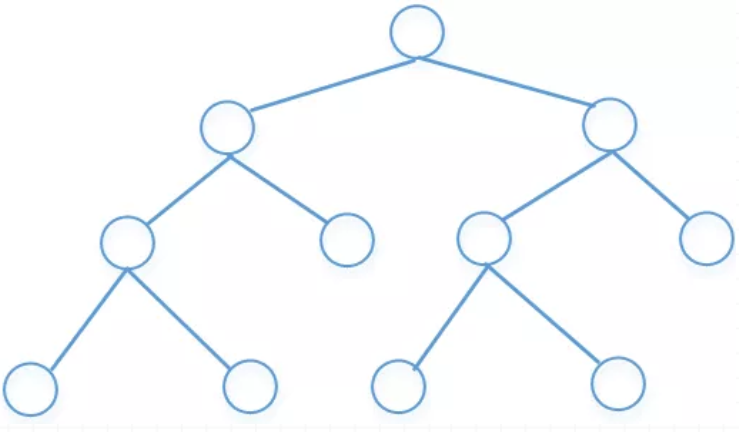
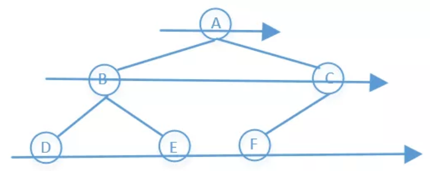
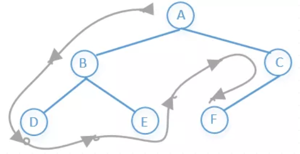
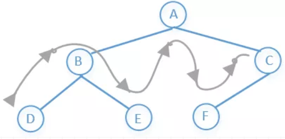
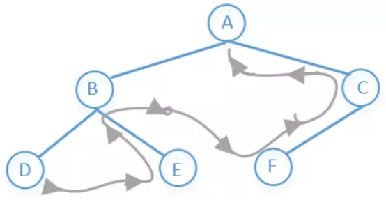

# 数据结构--树


<!--more-->

### 定义




如上图所示，**树是一个有n个有限节点组成一个具有层次关系的集合**，每个节点有0个或者多个子节点，没有父节点的节点称为根节点。

> 树的种类比较多，有**二叉树，红黑树，AVL树，B树，哈夫曼树，字典树**等等。
>

树的这么多种类中，我们最常见的应该是**二叉树**了，下面我们来看看如何实现二叉树的一些基本功能。

### 基本概念

1. 结点的度：一个结点含有的子结点的个数称为该结点的度；
2. 叶结点或终端结点：度为0的结点称为叶结点；
3. 非终端结点或分支结点：度不为0的结点；
4. 双亲结点或父结点：若一个结点含有子结点，则这个结点称为其子结点的父结点；
5. 孩子结点或子结点：一个结点含有的子树的根结点称为该结点的子结点；
6. 兄弟结点：具有相同父结点的结点互称为兄弟结点；
7. 树的度：一棵树中，最大的结点的度称为树的度；
8. 结点的层次：从根开始定义起，根为第1层，根的子结点为第2层，以此类推；
9. 树的高度或深度：树中结点的最大层次；
10. 堂兄弟结点：双亲在同一层的结点互为堂兄弟；
11. 结点的祖先：从根到该结点所经分支上的所有结点；
12. 子孙：以某结点为根的子树中任一结点都称为该结点的子孙。
13. 森林：由m（m>=0）棵互不相交的树的集合称为森林；
14. 无序树：树中任意节点的子结点之间没有顺序关系，这种树称为无序树,也称为自由树;
15. 有序树：树中任意节点的子结点之间有顺序关系，这种树称为有序树；
16. 二叉树：每个节点最多含有两个子树的树称为二叉树；
17. 完全二叉树：若设二叉树的深度为h，除第 h 层外，其它各层 (1～h-1) 的结点数都达到最大个数，第 h 层所有的结点都连续集中在最左边，这就是完全二叉树
18. 满二叉树：除最后一层无任何子节点外，每一层上的所有结点都有两个子结点的二叉树。
19. 哈夫曼树：带权路径最短的二叉树称为哈夫曼树或最优二叉树；

### 构造节点

一个完整的树节点包括当前节点值、左节点指针和右节点指针

```python 
class Node(object):
    """构造树节点"""
    def __init__(self, item):
        # 节点的值
        self.element = item
        # 左子节点
        self.lchild = None
        # 右子节点
        self.rchild = None
```

### 构造树

```python
class Tree(object):
    """二叉树"""
    def __init__(self, root = None):
        self.root = root
```

### 添加节点

添加节点是按照顺序（一层一层）添加的，如下图所示的二叉树，依次添加的节点为`[A, B, C, D, E, F]`，想要添加元素，就必须先遍历节点，所以需要一层层遍历节点，判断节点的左右子节点是否为空。


具体的添加过程：

- 如果树为空，直接添加在根节点就行，如A节点

- 如果不为空，需要通过队列遍历节点，逐个判断节点的左右子节点是否为空
  - 如现在树不为空，已经有了A节点`[A]`
  - 弹出A节点，判断左节点是否为空，是，添加B；否，B入队列，同理判断右节点
  - 依次类推，每次循环弹出一个节点，先后判断左右节点是否为空，为空则加入待添加元素，不为空则如队列

具体的代码实现如下：

```python
def add(self, item):
    node = Node(item)
    # 判断树是否为空树
    if self.root is None:
        self.root = node
        return
    queue = [self.root]
    while queue:
        # 弹出元素
        cur_node = queue.pop(0)
        # 判断左子节点
        if cur_node.lchild is None:
            cur_node.lchild = node
            return
        else:
            queue.append(cur_node.lchild)
        # 判断右子节点
        if cur_node.rchild is None:
            cur_node.rchild = node
            return
        else:
            queue.append(cur_node.rchild)
```

### 遍历节点

遍历节点就是访问树的各个节点，一般分为两种，广度优先（层次遍历）和深度优先。

#### 广度优先遍历

访问顺序是：先访问上一层，在访问下一层，一层一层的往下访问

所以上图前序遍历的结果是：**A→B→C→D→E→F**

访问顺序如下



具体代码如下：

```python
def bread_travel(self):
    """广度优先遍历/层次遍历"""
    queue = [self.root]
    while queue:
        cur_node = queue.pop(0)
        print(cur_node.element)
        if cur_node.lchild:
            queue.append(cur_node.lchild)
        if cur_node.rchild:
            queue.append(cur_node.rchild)
```

#### 深度优先遍历

深度优先遍历一般分为先序、中序、后序三种，所谓的先、中、后是指根节点的访问顺序，而且左节点永远在右节点前。

##### 先序遍历

访问顺序是：**根节点→左子树→右子树**

所以上图前序遍历的结果是：**A→B→D→E→C→F**

访问顺序如下



具体的代码如下：

递归方式

```python
def pre_deep_travel(self, node):
    """先序遍历"""
    if node is None:
        return 
    print(node.element, end='  ')
    self.pre_deep_travel(node.lchild)
    self.pre_deep_travel(node.rchild)
```

非递归方式

```python
def pre_deep_travel1(self, node):
    if node is None:
        return 
    stack = [node]
    while stack:
        node = stack.pop()
        print(node.element, end= '  ')
        if node.right:
            stack.append(node.right)
        if node.left:
            stack.append(node.left)
```

##### 中序遍历

访问顺序是：**左子树→根节点→右子树**

所以上图前序遍历的结果是：**D→B→E→A→F→C**

访问顺序如下



具体的代码如下：

递归方式

```python
def in_deep_travel(self, node):
    """中序遍历"""
    if node is None:
        return 
    self.in_deep_travel(node.lchild)
    print(node.element, end='  ')
    self.in_deep_travel(node.rchild)
```

非递归方式

```python
def in_deep_travel1(self, node):
    stack = []
    while node or stack:
        # 先添加所有左节点
        while node is not None:
            stack.append(node)
            node = node.left
        if stack:
            node = stack.pop()
            print(node.element, end='  ')
            # 再添加右节点
            node = node.right
```

##### 后续遍历

访问顺序是：**左子树→右子树→根节点**

所以上图前序遍历的结果是：**D→E→B→F→C→A**

访问顺序如下



具体大代码如下：

递归方式

```python
def post_deep_travel(self, node):
    """后序遍历"""
    if node is None:
        return 
    self.post_deep_travel(node.lchild)
    self.post_deep_travel(node.rchild)
    print(node.element, end='  ')
```

非递归方式

双栈法，很巧妙的方法，每个节点入第一个栈的顺序是`[根, 左, 右]`，其实就是反过来的先序遍历，在每次循环时，弹出第一个栈的栈顶元素，并入第二个栈，那么每个节点在第二个栈的顺序是`[根, 右, 左]`。本质就是**把反过来的先序遍历再反一遍**，就是后续遍历。

```python
def post_deep_travel1(self, node):
    if node is None:
        return
    stack1 = [node]
    stack2 = []
    while stack1:
        node = stack1.pop()
        stack2.append(node)
        if node.left:
            stack1.append(node.left)
        if node.right:
            stack1.append(node.right)
    while stack2:
        node = stack2.pop()
        print(node.element, end='  ')
```


